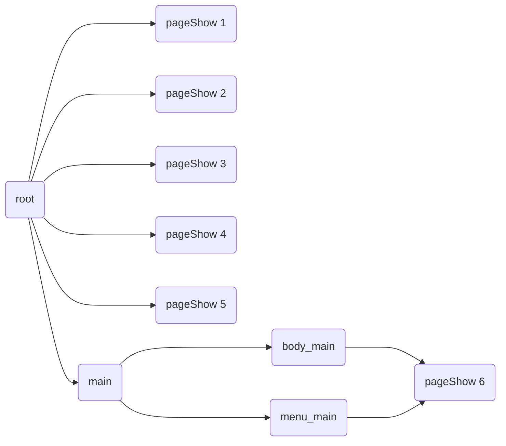
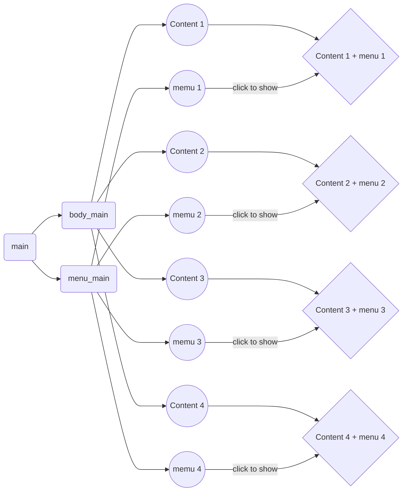
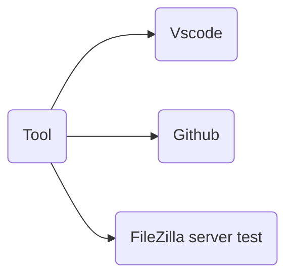

```javascript

Yojoies 前端开发工作手册 (คู่มือการใช้งานฟรอนต์เอน)

目录：
一、前端开发准测：
1、标准使用工具：Visual Studio；
<!-- 使用工具和搭建环境的学习 -->

2、html和css中不可使用属性；(ไม่สามารถใช้แอตทริบิวต์ใน html และ css)
<!-- 知道可以使用的属性标准和为什么使用 -->

3、JavaScript中的使用规则：基于jQuery (กฎการใช้งานใน JavaScript: ขึ้นอยู่กับ jQuery)
<!-- 特别指向使用插件的范围：必须使用插件；可延申使用插件 -->

4、基本使用方法：(การใช้งานพื้นฐาน)
a，全局变量；(ตัวแปรโกลบอล)
<!-- 特指在index中的所有编写方法 -->
b，菜单模式；(โหมดเมนู)
<!-- 特指如何编写main.html页的方法 -->
c，单页标准模式；(โหมดมาตรฐานหน้าเดียว)
<!-- @temple.html是一个可编写的空页，作为单页标准页 -->

b，单页特殊模式；(โหมดพิเศษหน้าเดียว)
<!-- 举例：start、login、register、lang页都是作为特殊页来进行编写 -->


e，widget.js中的定义；(คำจำกัดความ)
<!-- 赋予这个js文件功能，与index配合使用，同时作用于全局变量。 -->

@==> pageInit 函数功能 使用后，初始化每页固定其宽高位置的方法。(ฟังก์ชั่น: หลังการใช้งาน ให้เริ่มต้นวิธีการกำหนดความกว้างและความสูงของแต่ละหน้า)
@==> pageShow 使用后，(หลังการใช้งาน)


f，基本css页的使用；(การใช้หน้า CSS พื้นฐาน)
<!-- 如何使用bSytle.html页，设置app布局风格的编写方法 -->


g，多语言编写模式；(โหมดการเขียนหลายภาษา)
<!-- 调用方法如何使用lang.html -->


h，弹窗编写模式；(โหมดการเขียนหน้าต่างป๊อปอัป)
<!-- 调用方法如何使用：alert、msgObj -->


二、高级编写模式与规则：(รูปแบบและกฎการเขียนขั้นสูง)

1、页面编写格式标准；(รูปแบบการเขียนหน้ามาตรฐาน)
    a. token (วิธีการทำงาน เป็นกุญแจในการเปิดประตูสู่แอป)
    b. var (การประกาศตัวแปรทุกอย่างในการทำงาน)
    c. $("#xxx").click(function(){});(รูปแบบการเขียนแบบคลิกแบบนี้เท่านั้น!!!)
    d. $(document).ready(function(){}); (การอ่านของการโหลด)
    e. function xxx() {}; (วิธีการใช้งานฟังก์ชัน  xxx() ชื่อฟังก์ชัน จะใช้การเขียนแบบนี้หมดเลย)
    f. this.xxx = function() {}; (รูปแบบการเรียกใช้ฟังก์ชัน)
    g. msgObj.show(NSLang('xxx.xxxxx'), function () { 
        //  do code  something and logic when click confirm
    })(รูปแบบแจ้งเตือนแบบมีปุ่ม ยืนยัน และ ยกเลิก)
    h. msgPageObj.show(NSLang('xxx.xxxx'))(รูปแบบแจ้งเตือนทั้งหน้า)
    i. msgObj.unShow();(ยกเลิกการโชว์ popup)
    j. loaderObj.show();(โชว์การโหลดข้อมูล)
    k. loaderObj.unShow(); (ยกเลิกการโชว์โหลดข้อมูล)
    l. pageShow('idPage');(โชว์หน้าที่ต้องการ)
    m. pageUnShow('idPage')(ปิดหน้าที่ต้องการ)
    n. myScroll = new IScroll('#xxxx', { probeType: 1,mouseWheel: true });(ใช้เลื่อนหน้าแต่ละ ID)
    o.$("#xxxxx").css({ "width": "100%""height": headH, "left": (-1.0) * w, "top": 0 });(กำหนด css ส่วนหัว)
    p.$("#xxxxxx").css({ "width": w, "height": h - headH - menuH, "position": "absolute", "left": (-1.0) * w, "top": headH }) (กำหนด โครงของหน้า แต่ละ ID)


2.ฟังก์ชันการทำงาน

    a.ฟังก์การทำงานแบบ fix 

    // index.html
    startApp();  ฟังก์ชัน สำหรับเริ่ม หน้าแอป
    setAllPageLang(); ฟังก์ชันสำหรับการตั้งค่าภาษาในแอป
    firstCheckToken(); ฟังก์ชันสำหรับการเช็ค token ครั้งแรกตอนแอปทำงาน

    // login.html
    loginFun(); ใช้สำหรับ login
    registerObj.checkLoginStatusWithRefreshToken(); เช็คสถานะ ล็อคอิน

    // register.html
    registerFun(); ใช้สำหรับ ลงทะเบียน

    // main.html
    mainObj.refreshToken(); ฟังก์ชันรีเฟรชทุกๆ 30 นาที
    refreshTokenFun(); ฟังก์ชันรีเฟรช token ทุกๆ 30 นาที
    mainObj.checkAjaxResult(); ฟังก์ชัน เช็ค result.code จาก API  
    logoutFun()； ฟังก์ชัน token หมดอายุให้ logout


    // widget.js
    resObj() ; ฟังก์ชันแปลงโค๊ดทั้งหมดเข้า base 64 สำหรับน้ำไปสร้างไฟล์  build app
    pageInit(); ฟังก์ชันเริ่มต้นในการตั้งค่าแต่ละหน้าแต่ละหน้า
    headerInit(); ฟังก์ชันในการตั้งค่าหัวข้อแต่ละหน้า
    pageShow(); ฟังก์ชันเรียกหน้าโชว์
    pageUnShow(); ฟังก์ชันปิดหน้าโชว์
    alert(); ฟังก์ขันโชว์ป๊อปอับ
    loader(); ฟังก์ขันโชว์โหลด
    messageBox(); ฟังก์ขันโชว์ป๊อปอับบอล๊ค ให้เลือกตกลง ยกเลิก เพื่อไปใช้งานฟังก์ชันอื่นต่อ
    messagePage(); ฟังก์ขันโชว์ป๊อปอับหน้า 
    checkIsAndroid(); ฟังก์ขันเช็คแอรนดอย

    b.ฟังก์การทำงานแบบไม่ fix
    // lang.html
    setAllUILang(); ฟังก์ขันตั้งค่าภาษาในแต่ละหน้า
    getStatusCode(); ฟังก์ขันตั้งค่าภาษาในแต่ละหน้าจาก API code


```


# Yojoies Development Document (Front-end developer)
## Model Structure Project
All components have 4 parts


- [CSS Structure](#CSS-structure)
    - [Login css](#login-css)
    - [Main css](#main-css)
- [Html Structure](#html-structure)
    - [aTemplate html structure](#atemplate-html-structure) 
    - [bStyle html structure](#bstyle-html-structure) 
    - [Index html structure](#index-html-structure)   
    - [Page init html](#page-init-html)
    - [Login html structure](#login-html-structure)
    - [Main html structure](#main-html-structure)
    - [Lang html structure](#lang-html-structure)
       
- [Javascript Structure](#javascript-structure)
    - [Index javascript structure](#index-javascript-structure)
      - [Chart components index page](#chart-components-index-page)
    - [Main javascript structure](#main-javascript-structure)
      - [Chart components main page](#chart-components-main-page)
    - [Login javascript structure](#login-javascript-structure)
    - [Register javascript structure](#register-javascript-structure)
    - [Widget javascript structure](#widget-javascript-structure)
    - [Pic javascript structure](#pic-javascript-structure)
    - [Build javascript structure](#build-javascript-structure)

- [Tool](#tool)


### CSS Structure

#### Login css

```javascript

// Initail html project
html {
    user-select: none;
    -webkit-touch-callout: none;
    -webkit-user-select: none;
    -khtml-user-select: none;
    -moz-user-select: none;
    -ms-user-select: none;
    font-family: 'Roboto', sans-serif
}

/* main */

input:focus,
select:focus {
    outline: none;
}

.swal2-modal .swal2-styled:focus {
    -webkit-box-shadow: none;
    box-shadow: none;
}

.swal2-container>.swal2-popup {
    width: 80%;
}

.menuCss {
    height: 100%;
    display: flex;
    justify-content: center;
    align-items: center;
}

/* login */ 

// for custom bg page Init
.pageInit {
    background: linear-gradient(25deg, #E0EAFC 0%, #8da9f5 100%);
    position: absolute;
    flex-direction: column;
}
// box in put class login
.coverBoxInput {
    display: flex;
    justify-content: center;
    width: 80%;
    position: relative;
    margin: 0 auto;
}

.coverBoxInput>img {
    position: absolute;
    left: 20px;
    width: 25px;
    height: 25px;
}

.boxInput {
    padding: 5px 20px;
    border: 0px;
    background-color: #fff;
    width: 80%;
    height: 45px;
    border-radius: 5px;
    font-size: var(--text-size02);
    border-radius: 20px;
    box-shadow: 1px 4px 4px 0px #457BFF3D inset;
    padding-left: 58px;
    width: 100%;

}

// Submit botton login
.btnComm {
    display: flex;
    justify-content: center;
    align-items: center;
    color: #ffffff;
    background-color: var(--bg-theme);
    border-radius: 10px;
    font-weight: bold;
    width: 80%;
    height: 45px;
    border-radius: 20px;
}

.spanUnderSubmit {
    width: 90%;
    height: 40px;
    font-size: 14px;
    gap: 10px;
    font-weight: bold;
}
// Check box 
.checkbox {
    width: 16px;
    height: 16px;
    border-radius: 8px;
    border: 1px #999999 solid;
}


```
#### Main css 

```javascript

// position start 
.positionZero {
    position: 0px;
    top: 0px;
    left: 0px;
}

// Img size
.bgSizeCover {
    background-repeat: no-repeat;
    background-size: cover;
}

// box menu
.coverMenu {
    width: 100%;
    height: 100%;
    display: flex;
    justify-content: center;
    align-items: center;
    border-top: 1px solid #b5b5b5;
}

// each menu
.menuDiv {
    width: 25%;
    flex-direction: column;
    gap: 0;
}

// span menu
.menuSpan {
    font-size: 10px; color: #97979B;
}


```


### Html Structure

#### aTemplate html structure


```javascript

<!-- 页的id名和定位 ชื่อเพจและตำแหน่ง-->
<div class="menuPage" id="aTemplePage" style="position: absolute;overflow: hidden;">

    <!-- 设定本页滑动id ตั้งค่ารหัสเลื่อนของหน้านี้-->
    <div id="aTempleScroller">

        <!-- 本页头部布局 เค้าโครงส่วนหัวของหน้านี้-->
        <div id="aTempleTop" class="pageTop">
            <div id="aTempleTopBack" class="pageTopBack">
                
            </div>
            <div id="aTempleTopTitle" class="">

            </div>
            <div id="aTempleBottom" class=""></div>
        </div>

        <!-- 本页显示部分布局 หน้านี้แสดงส่วนหนึ่งของเค้าโครง-->
        <div id="aTempleBody" style="width: 100%;height: 1000px;">
            <!-- 内容布局编写部分 ส่วนการเขียนเค้าโครงเนื้อหา -->
        </div>

    </div>
</div>

<script>

    var aTempleObj = new aTemple();
    aTempleObj.init();


    function aTemple() {

        //本页全局声明变量；
        var something;

        //对页面布局（包含scroll）和点击事件初始化
        this.init = function () { }

        //被调用后的执行函数方法
        this.call = function () { }


    }
</script>


```


#### bStyle html structure


```javascript

<style type="text/css">
    @import "css/home.css";
    @import "css/shopping.css";

    body {
        color: #000000;
        font-family: "Arial,Helvetica,sans-serif";
    }

    html,
    body {
        height: 100%;
        margin: 0px;
        padding: 0px;
        overflow: hidden;
        -webkit-touch-callout: none;
        -webkit-user-select: none;
    }


    .bggAll {
        background-image: url(https://static.meenmas.com/static/img/2023/03/754a69c1557f40f98973165e1109995e.png);
        background-repeat: no-repeat;
        background-attachment: fixed;
        background-position: center;


    }


    *:not([class*="icon"]):not(.fa):not(.fas):not(i) {
        font-family: "arial", "苹方-简" !important;
    }

    input[type="button"],
    input[type="submit"],
    input[type="reset"] {
        -webkit-appearance: none;
    }

    input::-webkit-input-placeholder {
        font-size: 12px;
        color: #999999;
    }

    ul {
        list-style: none;
        overflow: hidden;
    }

    li {
        list-style: none;
    }

    textarea {
        -webkit-appearance: none;
    }

    .button {
        border-radius: 0;
    }

    input:focus,
    textarea:focus {
        outline: none;
    }

    * {
        -webkit-overflow-scrolling: touch;
        -webkit-tap-highlight-color: transparent;
    }

    input {
        -webkit-user-select: auto;
        /*webkit浏览器*/
    }

    html {
        -webkit-text-size-adjust: none;
        -webkit-backface-visibility: hidden;
    }

    .flexCenter {
        display: flex;
        justify-content: center;
        align-items: center;
    }


    .flexCenterL {
        display: flex;
        justify-content: flex-start;
        align-items: center;
    }

    .flexCenterS {
        display: flex;
        justify-content: space-between;
        align-items: center;
    }

    .flexCenterR {
        display: flex;
        justify-content: flex-end;
        align-items: center;
    }

    .flexAlignL {
        display: flex;
        justify-content: center;
        align-items: flex-start;
    }

    .flexWordL {
        display: flex;
        align-items: flex-start;
    }


    .beflex {
        display: flex;
    }


    .seColor {
        width: 2.2em;
        height: 2.2em;
        border-radius: 50%;
        display: inline-block;
        border: 1px solid #888;
    }

    .opColor {
        display: flex;
        text-align: left;
        padding: 6px 14px;
        border: 1px solid #888;
        margin: 10px 10px 5px 0;
        border-radius: 5px;
        font-size: 4pt;
    }

    .opgoColor {
        display: flex;
        text-align: left;
        padding: 6px 14px;
        border: 2px solid #ff6700;
        margin: 10px 10px 5px 0;
        border-radius: 5px;
        font-size: 4pt;
    }

    .padA {
        padding: 0 2%;
    }

    .padB {
        padding: 0 5%;
    }


    .fbold {
        font-weight: bold;
    }

    .fontA {
        color: #FFFFFF;
    }

    .fontB {
        color: #000000;
    }

    .fontC {
        color: #929292;
    }

    .fontD {
        color: #21BB7D;
    }

    .fontD1 {
        color: #b2b2b2;
    }


    .fontE {
        color: #F55D48;
    }

    .fontF {
        color: #606060;
    }

    .fontG {
        color: #BF8605;
    }

    .fontH {
        color: #999999;
    }

    .fontI {
        color: #f18c34;
    }

    .fontJ {
        color: #F4F4F4;
    }


    .bgA {
        background-color: #FFFFFF;
    }

    .bgA90 {
        background-color: #FFFFFFE6;
    }

    .bgB {
        background-color: #000000;
    }

    .bgC {
        background-color: #21BB7D;
    }

    .sybgA {
        background-color: #e5730a;
    }


    .bgCa {
        background-color: #F55D48;
    }

    .bgD {
        background-color: #F4F4F4;
    }

    .bgE {
        background-color: #FF1F00;
    }

    .bgF {
        background-color: #606060;
    }

    .bgG {
        background-color: #cccccc;
    }

    .bgH {
        background-color: rgb(33, 187, 125, 0.3)
    }

    .bgS {
        background-color: #21BB7D19;
    }

    .bgJ1 {
        background-color: #f8c10e;
    }

    .bgJ2 {
        background-color: #f8500e;
    }

    .btnLogin {
        background-color: #f18c34;
    }

    .btnBg {
        background-color: #d8d8d8;
    }


    .hide {
        display: none;
    }

    .show {
        display: block;
    }


    /* 字体大小属性  */

    .fz10 {
        font-size: 10px;
    }

    .fz12 {
        font-size: 0.75rem;
    }

    .fz13 {
        font-size: 0.8125rem;
    }

    .fz14 {
        font-size: 0.875rem;
    }

    .fz15 {
        font-size: 0.9rem;
    }

    .fz16 {
        font-size: 1rem;
    }

    .fz18 {
        font-size: 1.125rem;
    }

    .fz20 {
        font-size: 1.25rem;
    }

    .fz22 {
        font-size: 1.375rem;
    }

    .fz24 {
        font-size: 1.5rem;
    }

    .fz26 {
        font-size: 1.625rem;
    }

    .fz28 {
        font-size: 1.75rem;
    }

    .fz30 {
        font-size: 1.875rem;
    }

    .fz32 {
        font-size: 2rem;
    }


    /* 圆角属性 */

    .br3 {
        border-radius: 35px;
    }

    .br5 {
        border-radius: 5px;
    }

    .br8 {
        border-radius: 8px;
    }

    .br16 {
        border-radius: 16px;
    }

    .br20 {
        border-radius: 20px;
    }

    .br25 {
        border-radius: 25px;
    }

    .br30 {
        border-radius: 30px;
    }


    

    .taL {
        text-align: left;
    }

    .taR {
        text-align: right;
    }

    .taC {
        text-align: center;
    }

    .borderA {
        border: 1px #000000 solid;
    }

    .borderB {
        border: 1px #F4F4F4 solid;
    }

    .borderC {
        border: 1px #BF8605 solid;
    }

    .syborder {
        border: 2px #f55d48 solid;
    }

    .borderD {
        border: 1px #dedede solid;
    }

    .btnA {
        background-color: #21BB7D;
        color: #FFFFFF;
        text-align: center;
    }

    .btnB {
        background-color: #999999;
        color: #FFFFFF;
        text-align: center;
    }


    .pageTop {
        width: 100%;
        height: 44px;
        display: flex;
        background-color: #FFFFFF;
    }

    .pageTopBack {
        width: 15%;
        display: flex;
        justify-content: center;
        align-items: center;
    }

    .pageTopTitle {
        width: 70%;
        display: flex;
        justify-content: center;
        align-items: center;
        font-size: 14px;
    }

    .pageTopBtn {
        width: 15%;
        display: flex;
        justify-content: center;
        align-items: center;
    }
</style>


<style type="text/css">
    * {
        padding: 0;
        margin: 0;
        list-style: none;
        border: 0;
    }

    .all {
        /* width: 500px; */
        width: 100vw;
        height: 150px;
        /* padding: 7px; */
        /* border: 1px solid #ccc; */
        /* margin: 100px auto; */
        position: relative;
    }

    .screen {
        /* width: 500px; */
        width: 100vw;
        height: 150px;
        overflow: hidden;
        position: relative;
    }

    .screen li {
        width: 100vw;
        height: 150px;
        overflow: hidden;
        float: left;
    }

    .screen ul {
        position: absolute;
        left: 0;
        top: 0px;
        width: 3000px;
    }

    .all ol {
        position: absolute;
        right: 10px;
        bottom: 10px;
        line-height: 20px;
        text-align: center;
    }

    .all ol li {
        float: left;
        width: 20px;
        height: 20px;
        background: #fff;
        border: 1px solid #ccc;
        margin-left: 10px;
        cursor: pointer;
    }

    .all ol li.current {
        background: yellow;
    }

    #arr {
        display: none;
    }

    #arr span {
        width: 40px;
        height: 40px;
        position: absolute;
        left: 5px;
        top: 50%;
        margin-top: -20px;
        background: #000;
        cursor: pointer;
        line-height: 40px;
        text-align: center;
        font-weight: bold;
        font-family: '黑体';
        font-size: 30px;
        color: #fff;
        opacity: 0.3;
        border: 1px solid #fff;
    }


    .fontStyle1 {

        box-sizing: border-box;
        word-break: break-all;
        border: #21bb7d;
        border-style: solid;
        border-width: 1px;

        border-radius: 5px;


    }

    .fontStyle2 {

        box-sizing: border-box;
        word-break: break-all;
        border: #F55D48;
        border-style: solid;
        border-width: 1px;

        border-radius: 5px;


    }

    #arr #right {
        right: 5px;
        left: auto;
    }
</style>


```


#### Index html structure

Overall structure html project ( All components will show in index.html)

```javascript
<!DOCTYPE html>

<head>
    <meta charset="utf-8">
    <meta name="viewport"
        content="width=device-width, initial-scale=1.0, user-scalable=no, minimum-scale=1.0, maximum-scale=1.0" />
    <meta http-equiv="Cache-Control" content="no-cache, no-store, must-revalidate" />
    <meta http-equiv="Pragma" content="no-cache" />
    <meta http-equiv="Expires" content="0" />
    // Link CSS
    <link rel="shortcut icon" href="#" />
    <link rel="stylesheet" href="js/spinnew.css?version=1.1.38" />
    <link rel="stylesheet" href="css/login.css">
    <link rel="stylesheet" href="css/main.css">
    <link href='https://fonts.googleapis.com/css?family=Roboto' rel='stylesheet'>
    <link rel="stylesheet" href="css/quill.core.css?version=1.3.6" />
    <link rel="stylesheet" href="css/quill.mention.min.css?version=3.1.0" />

    // Link Script js
    <script language="javascript" type="text/javascript" src="js/jquery.js?version=1.0.0.1"></script>
    <script language="javascript" type="text/javascript" src="js/jquery.transit.js?version=1.0.0.1"></script>
    <script language="javascript" type="text/javascript" src="js/base64.js"></script>
    <script language="javascript" type="text/javascript" src="js/widget.js"></script>
    <script language="javascript" type="text/javascript" src="js/wsFormat.js"></script>
    <script language="javascript" type="text/javascript" src="js/iscroll-probe.js"></script>
    <script language="javascript" type="text/javascript" src="js/pic.js?version=1.0.1"></script>
    <script language="javascript" type="text/javascript" src="js/clipboard.min.js"></script>
    <script language="javascript" type="text/javascript" src="js/spinnew.js?version=1.0.0.1"></script>
    <script language="javascript" type="text/javascript" src="js/quill.min.js?version=1.3.6"></script>
    <script language="javascript" type="text/javascript" src="js/quill.mention.min.js?version=3.1.0"></script>
    <script language="javascript" type="text/javascript" src="js/language.js"></script>
    <script language="javascript" type="text/javascript" src="js/sweetalert2.all.min.js"></script>
    

</head>

<style>
  
  // all display css

    .flexCenter {
        display: flex;
        justify-content: center;
        align-items: center;
    }
    .flexLeft {
        display: flex;
        justify-content: left;
        align-items: center;
    }
    .flexRight {
        display: flex;
        justify-content: right;
        align-items: center;
    }
    .flexTop {
        display: flex;
        justify-content: start;
        align-items: center;
    }
    .flexBottom {
        display: flex;
        justify-content: end;
        align-items: center;
    }
    .flexSpac {
        display: flex;
        justify-content: space-between;
        align-items: center;
    }

  

</style>

<body style="overflow: hidden; margin: 0px;">

    // Content show page
    <div id="root" class="font-medium" ></div>


    // Alert boxs message
    <div id="messageBox"
        style="z-index: 997;position: absolute;left: 0px;top: 0px;display: none;width: 1px;height: 1px;">
        <div id="messageBoxBg" style="position: absolute;left: 0px;top: 0px;background-color: #000000;opacity: 0.7;">
        </div>
        <div id="messageBoxBodyBg"
            style="position: absolute;left: 0px;top: 0px;display: flex;justify-content: center;align-items: center;">
            <div id="messageBoxBody"
                style="background-color: #f7f7f7;border-radius: 15px;box-shadow: 0px 0px 5px 5px rgb(0, 0, 0,0.2);">
                <div style="height: 20px;"></div>
                <div id="msgContent"
                    style="text-align: center;width: 80%;height: 140px;display: flex;justify-content: center;align-items: center;margin: auto;">
                    Content
                </div>
                <div
                    style="width: 100%;height:30px;display: flex;justify-content: center;align-items: center;margin-top: 3px;">
                    <div id="msgBtnOK"
                        style="width:100%;height:45px;background-color:#ff5b5a;border-radius:0px 0px 0px 5px;display: flex;justify-content: center;align-items: center;color: #ffffff;">
                        确认</div>

                    <div style="background-color:#868686;width:2px"></div>
                    <div id="msgBtnCancel"
                        style="width:100%;height:45px;background-color:#ededed;border-radius: 0px 0px 5px 0px;display: flex;justify-content: center;align-items: center;">
                        取消</div>
                </div>
                <div style="height: 10px;"></div>
            </div>
        </div>
    </div>

    // Alert boxs message
    <div id="messagePage"
        style="z-index: 996;position: absolute;left: 0px;top: 0px;display: none;width: 1px;height: 1px;">
        <div id="messagePageBg" style="position: absolute;left: 0px;top: 0px;background-color: #000000;opacity: 0.7;">
        </div>
        <div id="messagePageBodyBg"
            style="position: absolute;left: 0px;top: 0px;display: flex;justify-content: center;align-items: center;">
            <div id="messagePageBody"
                style="background-color: #f7f7f7;border-radius: 15px;box-shadow: 0px 0px 5px 5px rgb(0, 0, 0,0.2);">
                <div style="height: 30px;display: flex;">
                    <div id="msgPageBtnClose"
                        style="display: none;justify-content: center;align-items: center;width: 30px;height: 100%;">
                        x
                    </div>
                </div>
                <div id="msgPageContent"
                    style="width: 100%;height:160px;display: flex;justify-content: center;align-items: center;">
                    Content
                </div>
                <div style="height: 10px;"></div>
            </div>
        </div>
    </div>

    // Alert boxs message
    <div id="alert"
        style="display: none;z-index: 998;position: absolute;left: 0px;top: 0px;background-color: #000000;opacity: 0.9;justify-content: center;align-items: center;">
        <div id="alertMsg"
            style="display: flex;justify-content: center;align-items: center;background-color: #cccccc;border-radius: 20px;padding: 10px;">

        </div>
    </div>
    // Loading page
    <div id="loader"
        style="display: none;z-index: 999;position: absolute;left: 0px;top: 0px;background-color: #000000;opacity: 0.4;justify-content: center;align-items: center;">

    </div>

</body>

</html>


```


#### Page init html

Conponents comon for using all new page show

```javascript

<div id="startPage" class="flexCenter pageInit">

// header detail
    <div id="start_header"></div>
// body detail
    <div id="start_body"></div> 
   
</div>

<script>

    var startObj = new start();
    startObj.init();
    function start() {
        this.init = function() {
            pageInit("startPage");
            headerInit("start", "Start")

            //1、初始化页面，用css定义本页页面；สร้างหน้าเริ่มต้น กับกำหนด css
            //2、所有本页页面的点击事件写在这里；ทุกส่วนที่เกี่ยวกับการ คลิก
            
        }
        this.call = function() {
            pageShow("startPage")

            //1、scroll滑动的调用；เรียกใช้งาน  scroll
            //2、运行本页的其他function; การทำงานของฟังก์ชัน


        }
        function loadlist() {

        }
    }
</script>

```


#### Login html structure

```javascript

<div id="loginPage" class="flexCenter pageInit">

    <div style="height: 20px;"></div>

    <div style="width: 100%;" class="flexCenter loginImg">
        
    </div>

    <div style="height: 10px;"></div>

    <div class="flexCenterColW100">

        <div id="welcome_back" class="headerSpan">Welcome Back</div>
        <div style="height: 15px;"></div>
        <div id="sign_to_con">Sign to continue</div>
        <div style="height: 15px;"></div>

    </div>

    <div class="flexCenterColW100">

        <div style="height: 20px;"></div>

        // input box
        <div class="coverBoxInput">
            
            <input id="mobileLogin" class="boxInput" type="number" placeholder="Phone" pattern="/^-?\d+\.?\d*$/"
                onKeyPress="if(this.value.length==11) return false;" />
        </div>
        <div style="height: 15px;"></div>

        <div class="coverBoxInput">
            
            <input id="password" class="boxInput" type="password" placeholder="Password"/>
        </div>

        <div style="height: 15px;"></div>

        <div class="flexCenter" style="font-size: 10px;">
            <input type="checkbox" id="checkBtnAgreementBtnLogin" class="checkbox">
            <div style="width:5px"></div>
            <span id="login_span1" style="color: #000;"></span>&nbsp;
            <span id="login_span2" style="color:#457BFF;"></span>&nbsp;
            <span id="login_span3" style="color: #000;"></span>&nbsp;
            <span id="login_span4" style="color:#457BFF ;"></span>
        </div>

        <div style="height: 20px;"></div>

    </div>

    // submit box
    <div class="login_bottom flexEndColW100">

        <div id="loginBtn" class="btnComm">Login</div>
        <div style="height: 10px;"></div>
        <div class="flexCenter spanUnderSubmit">
            <div id="noAccount"></div>
            <div style="color:#457BFF;" id="goRegisterBtn"></div>
        </div>

    </div>

    <div style="height: 10px;"></div>

</div>

```


#### Main html structure


```javascript

<div id="main" class="positionZero">

    // body contents
    <div id="body_main" class="bgSizeCover">
    </div>

    // menu contents
    <div id="menu_main" style="width: 100%;">
    
        <div id="menu_main_content" class="bg-foot-all coverMenu">
           
            // Icons home
            <div id="menu_home" class="menuCss menuDiv">
                <div class="menuCss_pic">
                    <div class="menuOnClass" id="menuHome">
                        <svg >Icon1</svg>
                    </div>
                    <div class="menuOffClass" id="menuHome2" style="display: none;">
                        <svg>Icons1</svg>
                    </div>
                </div>
                <span class="menuSpan" id="menuHomeSpan">Home</span>
            </div>

            // Icons trade
            <div id="menu_trade" class="menuCss menuDiv">
                <div class="menuCss_pic">
                    <div class="menuOnClass" id="menuTrade" style="padding-top: 2px;">
                        <svg>Icons2</svg>
                    </div>
                    <div class="menuOffClass" id="menuTrade2" style="display: none; padding-top: 2px;">
                        <svg>Icons2</svg>
                    </div>
                </div>
                <span class="menuSpan" id="menuTradeSpan">Trade</span>

            </div>

            // Icons wallet
            <div id="menu_wallet" class="menuCss menuDiv">
                <div class="menuCss_pic">
                    <div class="menuOnClass" id="menuwallet">
                        <svg>Icons3</svg>
                    </div>
                    <div class="menuOffClass" id="menuwallet2" style="display: none;">
                        <svg>Icons3</svg>
                    </div>
                </div>
                <span class="menuSpan" id="menuwalletSpan">Wallet</span>
            </div>

            // Icons setting
            <div id="menu_setting" class="menuCss menuDiv">
                <div class="menuCss_pic">
                    <div class="menuOnClass" id="menuSetting">
                        <svg>Icons4</svg>
                    </div>
                    <div class="menuOffClass" id="menuSetting2" style="display: none;">
                        <svg>Icons4</svg>
                    </div>
                </div>
                <span class="menuSpan" id="menuSettingSpan">Setting</span>
            </div>


        </div>
    </div>

</div>

```


#### Lang html structure

```javascript

<script>

// เปลี่ยนภาษา
    var langCode = 'th'

    var NSLangArr = {

        // get start
        "getStart.start": { "en": "Get start", "zh": "开始使用", "th": "เริ่มต้นเลย", },

        // login

        "login.welcome_back": { zh: "欢迎回来", en: "Welcome back", th: "ยินดีต้อนรับกลับมา" },
        "login.signup": { zh: "签名以继续", en: "Sign to continue", th: "ลงชื่อเพื่อดำเนินการต่อ" },
        "login.login": { zh: "登录", en: "Login", th: "เข้าสู่ระบบ" },
        "login.mobileLogin": { zh: "电话号码", en: "Phone Number", th: "หมายเลขโทรศัพท์" },
        "login.password1": { zh: "密码", en: "Password", th: "รหัสผ่าน" },
        "login.login_span1": { zh: "我已阅读并同意", en: "I have read and agree to the ", th: "ฉันได้อ่านและยอมรับ " },
        "login.login_span2": { zh: "用户协议", en: "User Agreement", th: "ข้อตกลงผู้ใช้" },
        "login.login_span3": { zh: "及", en: "and", th: "และ" },
        "login.login_span4": { zh: "隐私条款", en: "Privacy Policy", th: "นโยบายความเป็นส่วนตัว" },
        "login.noAcc": { zh: "没有账号 ?", en: "Don't have an account?", th: "ยังไม่มีบัญชีหรือ?" },
        "login.goRegister": { zh: "马上注册", en: "Create a new account", th: "ลงทะเบียนเดี๋ยวนี้" },
        "login.policy": { "en": "Please confirm the privacy policy", "zh": "请确认隐私政策", "th": "กรุณายืนยันนโยบายความเป็นส่วนตัว", },
        "login.password": { "en": "Please enter the login password", "zh": "请输入登陆密码", "th": "กรุณากรอกรหัสผ่านเข้าสู่ระบบ", },

        // register
        "register.name": { zh: "姓名", en: "Name", th: "ชื่อ" },
        "register.password1": { zh: "重设密码", en: "Re-password", th: "รหัสผ่านอีกครั้ง" },
        "register.btn": { zh: "创造", en: "Create", th: "สร้าง" },
        "register.acc": { zh: "我已经有帐户", en: "I already have an account", th: "ฉันมีบัญชี" },
        "register.login": { zh: "登录", en: "Log in", th: "เข้าสู่ระบบ" },
        "register.fill": { "en": "Enter complete information", "zh": "输入完整信息", "th": "กรอกข้อมูลให้ครบถ้วน", },
        "register.digit": { "en": "Please enter your 11 digit phone number.", "zh": "请输入您的 11 位电话号码。", "th": "กรุณากรอกหมายเลขโทรศัพท์ 11 หลัก", },
        "register.pass": { "en": "Please enter a 6 to 30 digit password and confirmation password", "zh": "请输入6至30位数字的密码和确认密码", "th": "กรุณากรอกรหัสผ่าน 6 ถึง 30 หลักและรหัสผ่านยืนยัน", },
        "register.repass": { "en": "The two password inputs are inconsistent", "zh": "两次密码输入不一致", "th": "การป้อนรหัสผ่านทั้งสองไม่สอดคล้องกัน", },
        "register.success": { "en": "You have successfully registered an account", "zh": "您已成功注册帐号", "th": "คุณได้ลงทะเบียนบัญชีเรียบร้อยแล้ว", },

        // main
        "main.home": { zh: "主页", en: "Home", th: "หน้าหลัก" },
        "main.trade": { zh: "贸易", en: "Trade", th: "ซื้อขาย" },
        "main.wallet": { zh: "钱包", en: "Wallet", th: "กระเป๋า" },
        "main.setting": { zh: "主页", en: "环境", th: "ตั้งค่า" },

        // system app
        "sys.comfirm": { "en": "Confirm", "zh": "确认", "th": "ตกลง", },
        "sys.cancel": { "en": "Cancel", "zh": "取消", "th": "ยกเลิก", },
        "sys.serverError": { "en": "Server has a problem please try again", "zh": "服务器有问题请重试", "th": "เซิร์ฟเวอร์มีปัญหา โปรดลองอีกครั้ง", },
    


    }

    // เรียกฟังก์ชังฟันเปลี่ยนภาษา
    function setAllPageLang() {
        setAllUILang('getstart')
        setAllUILang("login")
        setAllUILang("register")
        setAllUILang("main")

    }
     // ตั้งค่าภาษาแต่ละหน้า
    function setAllUILang(page) {
        //
        $("#msgBtnOK").html(NSLang("sys.comfirm"))
        $("#msgBtnCancel").html(NSLang("sys.cancel"))

        // ส่วนแยกภาษาแต่ละหน้า
        switch (page) {

            case "getstart": {
                $("#getStart").html(NSLang("getStart.start"))
              

            } break
            case "login": {
                
                $("#welcome_back").html(NSLang("login.welcome_back"))
                $("#sign_to_con").html(NSLang("login.signup"))
                $("#mobileLogin").attr('placeholder', NSLang('login.mobileLogin'));
                $("#password").attr('placeholder', NSLang('login.password1'));
                $("#login_span1").html(NSLang("login.login_span1"))
                $("#login_span2").html(NSLang("login.login_span2"))
                $("#login_span3").html(NSLang("login.login_span3"))
                $("#login_span4").html(NSLang("login.login_span4"))
                $("#loginBtn").html(NSLang("login.login"))
                $("#noAccount").html(NSLang("login.noAcc"))
                $("#goRegisterBtn").html(NSLang("login.goRegister"))
                
                
            } break

            case "register": {
                $("#name").attr('placeholder', NSLang('register.name'));
                $("#mobile").attr('placeholder', NSLang('login.mobileLogin'));
                $("#r_password").attr('placeholder', NSLang('login.password1'));
                $("#r_password_again").attr('placeholder', NSLang('register.password1'));
                $("#registerBtn").html(NSLang("register.btn"))
                $("#alreadyAcc").html(NSLang("register.acc"))
                $("#loginNow2").html(NSLang("register.login"))

            } break
            case "main": {
                $("#menuHomeSpan").html(NSLang("main.home"))
                $("#menuTradeSpan").html(NSLang("main.trade"))
                $("#menuwalletSpan").html(NSLang("main.wallet"))
                $("#menuSettingSpan").html(NSLang("main.setting"))

            } break


           

            default: {

            } break

        }

    }
    // ฟังก์ชังฟันเปลี่ยนภาษา
    function NSLang(inStr) {
        try {
            var v = NSLangArr[inStr][langCode];
            if (v != null) {
                return v;
            } else {
                return inStr;
            }
        } catch (e) {
            return inStr;
        }

    }


</script>

<script>

// สเตตัสโค๊ด จากหลังบ้าน
    var statusCodesArr = {

        "0": { "en": "Success", "zh": "请求成功", "th": "สำเร็จ" },
        "2011": { "en": "Accepted", "zh": "请求已受理", "th": "ยอมรับแล้ว" },
        "4001": { "en": "Token expire", "zh": "账户已过期", "th": "Token หมดอายุ" },
        "4002": { "en": "Refresh token expire", "zh": "再次刷新账户", "th": "Refresh Token หมดอายุ" },
        "4010": { "en": "Mobile or password not correct", "zh": "电话号码或密码错误", "th": "หมายเลขโทรศัพท์หรือรหัสผ่านไม่ถูกต้อง" },
        "4011": { "en": "Invalid password", "zh": "密码错误", "th": "รหัสผ่านไม่ถูกต้อง" },
        "4014": { "en": "Invalid account name", "zh": "无效的用户名", "th": "ชื่อบัญชีไม่ถูกต้อง" },
        "4021": { "en": "Password not matches", "zh": "密码与当前密码不匹配", "th": "รหัสผ่านไม่ตรงกับรหัสผ่านปัจจุบัน" },
        "4022": { "en": "Existed account name", "zh": "用户名已经存在", "th": "มีชื่อบัญชีอยู่แล้ว" },
        "4023": { "en": "Existed mobile", "zh": "手机号已经存在", "th": "มีหมายเลขโทรศัพท์มือถือแล้ว" },
        "4024": { "en": "Sms code sample", "zh": "短信验证码不一致", "th": "รหัส SMS ไม่ตรงกัน" },
        "4025": { "en": "Destroy account", "zh": "已经注销的帐户", "th": "บัญชีถูกยกเลิกแล้ว" },
        "4029": { "en": "Invalid mobile", "zh": "无效的手机号", "th": "หมายเลขโทรศัพท์ไม่ถูกต้อง" },
        "4030": { "en": "Invalid user id", "zh": "无效用户ID", "th": "รหัสผู้ใช้ไม่ถูกต้อง" },
        "4031": { "en": "Balance not enough", "zh": "余额不足", "th": "ยอดเงินไม่เพียงพอ" },
        "4032": { "en": "Invalid wallet address", "zh": "无效钱包地址", "th": "ที่อยู่กระเป๋าเงินไม่ถูกต้อง" },
        "4033": { "en": "Invalid amount", "zh": "无效金额", "th": "จำนวนไม่ถูกต้อง" },
        "4034": { "en": "Withdraw fail", "zh": "提现失败", "th": "การถอนล้มเหลว" },
        "4035": { "en": "Invalid invite code", "zh": "无效邀请码", "th": "รหัสเชิญไม่ถูกต้อง" },
        "4036": { "en": "Invalid financial organization bank name", "zh": "无效金融机构银行名称", "th": "ชื่อธนาคารไม่ถูกต้อง" },
        "4037": { "en": "Invalid financial organization card number", "zh": "无效金融机构卡号", "th": "หมายเลขบัตรไม่ถูกต้อง" },
        "4038": { "en": "Invalid financial organization card name", "zh": "无效金融机构卡名", "th": "ชื่อบัตรไม่ถูกต้อง" },
        "4039": { "en": "Existed financial organization card number", "zh": "已存在金融机构卡号", "th": "มีหมายเลขธนาคารอยู่แล้ว" },
        "4040": { "en": "Invalid name", "zh": "无效姓名", "th": "ชื่อไม่ถูกต้อง" },
        "4041": { "en": "Invalid identity passport code", "zh": "无效身份证号码", "th": "รหัสบัตรประจำตัวไม่ถูกต้อง" },
        "4042": { "en": "Invalid step", "zh": "无效步骤", "th": "ขั้นตอนไม่ถูกต้อง" },
        "4043": { "en": "Existed checked in", "zh": "已签到", "th": "ได้ทำการเช็คอินแล้ว" },
        "4044": { "en": "Invalid product id", "zh": "无效产品ID", "th": "รหัสผลิตภัณฑ์ไม่ถูกต้อง" },
        "4045": { "en": "Not allow repeat purchase", "zh": "不允许重复购买", "th": "ไม่อนุญาตให้ซื้อซ้ำ" },
        "4046": { "en": "Purchase method is invalid", "zh": "购买方式无效", "th": "วิธีการซื้อไม่ถูกต้อง" },
        "4047": { "en": "Product state is invalid", "zh": "产品状态无效", "th": "สถานะผลิตภัณฑ์ไม่ถูกต้อง" },
        "4048": { "en": "Purchase method is not match", "zh": "购买方式不匹配", "th": "วิธีการซื้อไม่ตรงกัน" },
        "4049": { "en": "Product is off", "zh": "产品已下架", "th": "ผลิตภัณฑ์ถูกปิด" },
        "4050": { "en": "Account disabled", "zh": "用户已被禁用", "th": "บัญชีถูกปิดการใช้งาน" },
        "4051": { "en": "Invalid announcement id", "zh": "无效公告ID", "th": "รหัสประกาศไม่ถูกต้อง" },
        "4052": { "en": "Invalid wallet type", "zh": "无效钱包类型", "th": "ประเภทกระเป๋าเงินไม่ถูกต้อง" },
        "4053": { "en": "Invalid transaction type", "zh": "无效交易类型", "th": "ประเภทการธุรกรรมไม่ถูกต้อง" },
        "4054": { "en": "Invalid 2fa", "zh": "无效两步验证", "th": "การตรวจสอบความปลอดภัย 2 ขั้นตอนไม่ถูกต้อง" },
        "4055": { "en": "Withdraw not enabled", "zh": "提现未启用", "th": "การถอนเงินไม่ได้เปิดใช้งาน" },
        "4056": { "en": "Invalid notifications", "zh": "无效通知", "th": "การแจ้งเตือนไม่ถูกต้อง" },
        "4057": { "en": "Identity not verified", "zh": "身份未验证", "th": "ไม่ได้รับการตรวจสอบตัวตน" },
        "4058": { "en": "Not found bank name", "zh": "未找到银行名称", "th": "ไม่พบชื่อธนาคาร" },
        "4059": { "en": "Not found bank info apply type", "zh": "未找到银行信息申请类型", "th": "ไม่พบประเภทการสมัครข้อมูลธนาคาร" },
        "4062": { "en": "Not enough credit", "zh": "没有足够的额度", "th": "เครดิตไม่พอ" },
        "4063": { "en": "Activity points can only be used once", "zh": "活动积分只能使用", "th": "คะแนนกิจกรรมสามารถใช้ได้หนึ่งครั้งเท่านั้น" },
        "4064": { "en": "Not enough points", "zh": "积分不够", "th": "คะแนนไม่เพียงพอ" },
        "4065": { "en": "Insufficient Debt Settlement Fund Balance", "zh": "债务清算基金余额不足", "th": "ยอดกองทุนชำระหนี้ไม่เพียงพอ" },
        "4066": { "en": "You are not active enough, please try your best", "zh": "您的活跃度不够，请努力哦", "th": "คุณยังใช้งานไม่มากพอ โปรดพยายามให้ดีที่สุด" },
        "4067": { "en": "Not support debt settlement fund", "zh": "不支持债务清偿基金", "th": "ไม่สนับสนุนกองทุนการชำระหนี้" },
        "4068": { "en": "Invalid remark", "zh": "无效评论", "th": "หมายเหตุที่ไม่ถูกต้อง" },
        "4069": { "en": "Invalid financial organization wallet address", "zh": "无效的金融组织钱包地址", "th": "ที่อยู่กระเป๋าสตางค์ทางการเงินไม่ถูกต้อง" },
        "4070": { "en": "Existed financial organization wallet address", "zh": "现有金融机构钱包地址", "th": "ที่อยู่กระเป๋าเงินขององค์กรทางการเงินที่มีอยู่" },
        "4071": { "en": "Invalid financial organization wallet address", "zh": "无效的金融组织钱包地址", "th": "ที่อยู่กระเป๋าสตางค์ทางการเงินไม่ถูกต้อง" },
        "4072": { "en": "The purchase limit of this product has been reached today, please come back to purchase again tomorrow.", "zh": "今日该产品购买限额已满，请明天再来购买哦", "th": "หมายเหตุที่วันนี้ถึงขีดจำกัดการซื้อผลิตภัณฑ์นี้แล้ว โปรดกลับมาซื้ออีกครั้งในวันพรุ่งนี้ไม่ถูกต้อง" },
        "9999": { "en": "Unknown mistake", "zh": "未知错误", "th": "ไม่ทราบข้อผิดพลาด" }

    }

    // ฟังก์ชังฟันเปลี่ยนภาษา
    function getStatusCode(code) {
        var thisCode = code
        try {
            var v = statusCodesArr[thisCode][langCode];
            if (v != null) {
                return v;
            } else {
                return thisCode;
            }
        } catch (e) {
            return thisCode;
        }

    }
</script>


```
### Javascript Structure


#### Index javascript structure

```javascript

<script>

    // API path 
    var API_SERVER = "API path";

    var token = null;
    var deviceId = null;
    var platform = null;
    var refreshTokenTimer = null;
    var heartBeatTimer = null;
    var heartBeatTimeStamp = 0;

    var TIMEOUT = 10000;
    var PAGETIMEOUT = 300;

    //  width, height auto display
    var w = $(window).width();
    var h = $(window).height();


    // height header and menu
    var headH = 50;
    var menuH = 60;

    // init pop up alerts
    var alertObj = new alert();
    alertObj.init();
    var loaderObj = new loader();
    loaderObj.init();
    var msgObj = new messageBox();
    msgObj.init();
    var msgPageObj = new messagePage();
    msgPageObj.init();

    // set lang default
    var lang = localStorage.getItem('Language')
    if (lang == '' || lang == null) {
        localStorage.setItem('Language', 'EN')
    }
    var themeChange = localStorage.getItem('Theme')

    // set theme default
    if (themeChange == '' || themeChange == null || themeChange == 'theme-default') {
        localStorage.setItem('Theme', 'theme-default')
        $('#root').removeClass().addClass("theme-default");
    }
   
    // set size default
    var getFont = localStorage.getItem('Font-size')
    if (getFont == '' || getFont == null) {
        localStorage.setItem('Font-size', 'medium')
        $('body').removeClass().addClass("font-medium");
    }

    // convert html to res.json to build app
    var mResObj = new resObj("res.json");
    mResObj.setSuccessFun(startApp);
    mResObj.setErrorFun(errorApp);

    mResObj.init();
    mResObj.load();

    function startApp() {

        //底层页 ระดับล่างสุด
        mResObj.showHtml("lang.html", "root");
        mResObj.showHtml("main.html", "root");
        mResObj.showHtml("register.html", "root");
        mResObj.showHtml("login.html", "root");
        mResObj.showHtml("start.html", "root");
       
       //主页第一层；ระดับที่1


        //二级页面；ระดับที่2


        //三级页面；ระดับที่3
            
        mainObj.checkIsLogin();

        setAllPageLang()
        firstStartFun();

    }
    function errorApp() {
        console.log("load error");
    }

    function onBackPressed() {
        console.log('========>');  

    }

    function setDeviceId(, mPlatform) {
        deviceId = mDeviceId;
        platform = mPlatform;
    }

    function appComeback() {
        var t = new Date();
        console.log("i'm back !" + t.getTime());
        //loginObj.checkLoginStatusWithRefreshToken();
    }

    function openAgreement() {
        pageShow('agreementPage');
    }

    function openPrivacy() {
        pageShow('privacyPage');
    }

    function firstStartFun() {

        if (!checkIsAndroid()) {
            return;
        }
        var isNotFirst = localStorage.getItem('isFirst');
        if (!isNotFirst) {
            pageShow('firstStartPage');
        }

    }

    // Token check funtion
    function firstCheckToken() {

        if (token == null) {
            pageShow("loginPage");
            return;
        }

        var mData = { "token": token.refresh };

        $.ajax({
            type: "post",
            url: API_SERVER + "/v1/auth/refresh",
            data: JSON.stringify(mData),
            contentType: "application/json",
            dataType: "json",
            async: true,
            timeout: 100000,
            beforeSend: function (xmlhttprequest) {
            },
            success: function (data) {
                if (data.code == 0) {
                    var tokenObj = data.result;
                    localStorage.setItem('token', JSON.stringify(tokenObj));
                    getLocalToken();
                } else {
                    if (data.code == 4002) {
                        pageShow("loginPage");
                    }
                }
                // call home page show
                mainObj.menuhome();
            },
            error: function (xmlhttprequest, error) {
                console.log(error);
            },
            complete: function () {
            }
        });


    }

</script>

```

##### Chart components index page

รูปแบบการแสดงผลหน้าแอปของแต่ละหน้า


All components will be show in root in index.html


#### Main javascript structure


```javascript

<script>
    console.log("main");

    var mainObj = new main();
    mainObj.init();


    function main() {

        // init main  
        this.init = function () {

            $("#menu_main").css({ "height": menuH });
            $("#body_main").css({ "height": h - menuH });

        // Click call function to show html page in body_main
            $("#menu_home").click(function () {
                mainObj.menuhome();
                
            });

            $("#menu_trade").click(function () {
                mainObj.menutrade();
                
            });

            $("#menu_wallet").click(function () {
                mainObj.menuwallet();
                
            });

            $("#menu_setting").click(function () {
                mainObj.menusetting();
                
            });

            // show contents in body_main
            mResObj.showHtml("home.html", "body_main");
            mResObj.showHtml("trade.html", "body_main");
            mResObj.showHtml("wallet.html", "body_main");
            mResObj.showHtml("setting.html", "body_main");

        }

        // Show home page
         this.menuhome = function () {
            unShowMenuPage();

            $(".menuOnClass").css({ "display": "none" });
            $(".menuOffClass").css({ "display": "block" });
            $("#menuHome").css({ "display": "block" });
            $("#menuHome2").css({ "display": "none" });
            $("#menuHomeSpan").css({ "color": "var(--bg-foot)", "font-size": "12px" });
            $("#menuTradeSpan").css({ "color": "#97979B", "font-size": "10px" });
            $("#menuwalletSpan").css({ "color": "#97979B", "font-size": "10px" });
            $("#menuSettingSpan").css({ "color": "#97979B", "font-size": "10px" });
            // $("#body_main").css({ "background-image": "url(pic/new_bg.png)" });
            $("#main").css({ "background-color": "#80DEEA" });
            homeObj.init()
            homeObj.call()
        }

        // Show trade page
        this.menutrade = function () {
            unShowMenuPage();

            $(".menuOnClass").css({ "display": "none" });
            $(".menuOffClass").css({ "display": "block" });
            $("#menuTrade").css({ "display": "block" });
            $("#menuTrade2").css({ "display": "none" });
            $("#menuHomeSpan").css({ "color": "#97979B", "font-size": "10px" });
            $("#menuTradeSpan").css({ "color": "var(--bg-foot)", "font-size": "12px" });
            $("#menuwalletSpan").css({ "color": "#97979B", "font-size": "10px" });
            $("#menuSettingSpan").css({ "color": "#97979B", "font-size": "10px" });
            $("#main").css({ "background-color": "#F8BBD0" });
        
            tradeObj.init()
            tradeObj.call();
        }

        // Show wallet page
        this.menuwallet = function () {
            unShowMenuPage();

            $(".menuOnClass").css({ "display": "none" });
            $(".menuOffClass").css({ "display": "block" });
            $("#menuwallet").css({ "display": "block" });
            $("#menuwallet2").css({ "display": "none" });
            $("#menuHomeSpan").css({ "color": "#97979B", "font-size": "10px" });
            $("#menuTradeSpan").css({ "color": "#97979B", "font-size": "10px" });
            $("#menuwalletSpan").css({ "color": "var(--bg-foot)", "font-size": "12px" });
            $("#menuSettingSpan").css({ "color": "#97979B", "font-size": "10px" });
            $("#main").css({ "background-color": "#DCEDC8" });

            walletObj.init();
            walletObj.call();
    

        }

        // Show setting page
        this.menusetting = function () {
            unShowMenuPage();

            $(".menuOnClass").css({ "display": "none" });
            $(".menuOffClass").css({ "display": "block" });
            $("#menuSetting").css({ "display": "block" });
            $("#menuSetting2").css({ "display": "none" });
            $("#menuHomeSpan").css({ "color": "#97979B", "font-size": "10px" });
            $("#menuTradeSpan").css({ "color": "#97979B", "font-size": "10px" });
            $("#menuwalletSpan").css({ "color": "#97979B", "font-size": "10px" });
            $("#menuSettingSpan").css({ "color": "var(--bg-foot)", "font-size": "12px" });
            $("#main").css({ "background-color": "#CFD8DC" });
            
            settingObj.init()
            settingObj.call();


        }
        
        // Check login
        this.checkIsLogin = function () {
            getLocalToken();
            updateLoginStatus();
            if (token != null) {
                mainObj.refreshToken();
            } else {
                pageShow('startPage');
            }
        }

        // hide page
        function unShowMenuPage() {
            $(".menuPage").each(function () {
                $("#" + this.id).transition({
                    x: 0
                }, 0);
            });
            $(".menuHeader").each(function () {
                $("#" + this.id).transition({
                    x: 0
                }, 0);
            });
        }

        // update login status
        function updateLoginStatus() {
            var isLogin = false;
            if (token != null) {
                var nowTimeStamp = (new Date()).getTime();
                if (token.expire) {
                    var expireTime = token.expire * 1000;
                    if (nowTimeStamp < expireTime) {
                        isLogin = true;
                    } else {
                        mainObj.refreshToken();
                    }
                }
            }

            if (isLogin) {
                pageUnShow("loginPage");
                pageUnShow("startPage");
                mainObj.menuhome();
            } else {
                pageShow("startPage");
            }
        }

        // get token in storage
        function getLocalToken() {
            var tokenLocal = localStorage.getItem('token');
            if (tokenLocal != null) {
                token = JSON.parse(tokenLocal);
            }
        }

        var isRefreshTokenFinish = true;

        // refresh token
        this.refreshToken = function () {

            if (refreshTokenTimer) {
                clearInterval(refreshTokenTimer);
            }
            refreshTokenTimer = setInterval(function () {
                refreshTokenFun();
            }, 1800000);
        }

        function refreshTokenFun() {

            if (token == null) {
                pageShow("startPage");
                return;
            }

            var mData = { "token": token.refresh };

            isRefreshTokenFinish = false;

            $.ajax({
                type: "post",
                url: API_SERVER + "/v1/auth/refresh",
                data: JSON.stringify(mData),
                contentType: "application/json",
                dataType: "json",
                async: true,
                timeout: 100000,
                beforeSend: function (xmlhttprequest) {
                },
                success: function (data) {

                    if (data.code == 0) {
                        var tokenObj = data.result;
                        localStorage.setItem('token', JSON.stringify(tokenObj));
                        getLocalToken();
                        isRefreshTokenFinish = true;

                    } else {
                        mainObj.checkAjaxResult(data.code);
                    }
                },
                error: function (xmlhttprequest, error) {
                    console.log(error);
                },
                complete: function () {
                }
            });


        }

       

    }


</script>


```


##### Chart components main page


on click menu to show content

#### Login javascript structure

```javascript


<script>

    var loginObj = new login();
    loginObj.init();

    function login() {

        var isAgree = false;

        this.init = function () {

            callApp('ask_deviceId');
            askDeviceIdFun();

            setAllUILang("login")

            pageInit("loginPage");

            $('#login_phone').attr("src", picRes['phone.png'])
            $('#login_pass').attr("src", picRes['password.png'])


            $("#backBtn").click(function () {
                pageUnShow("loginPage");
            });

            $("#goRegisterBtn").click(function () {
                pageShow("registerPage");
            });

            $("#login_span2").click(function () {
                console.log('click');
                pageShow("agreementPage");
            });

            $("#login_span4").click(function () {
                console.log('click');
                pageShow("policyPage");
            });


            $("#checkBtnAgreementBtnLogin").click(function () {
                if (isAgree) {
                    $("#checkBtnAgreementBtnLogin").css({ "background-color": "#ffffff" });
                    $("#checkBtnAgreementBtnLogin").html('');
                    isAgree = false;
                } else {
                    //√）和叉号（×） - CodePen
                    $("#checkBtnAgreementBtnLogin").css({ "background-color": "#cccccc" });
                    $("#checkBtnAgreementBtnLogin").html('√');
                    isAgree = true;
                }
            });

            $("#loginBtn").click(function () {

                callApp('ask_deviceId');

                if (!isAgree) {

                    msgPageObj.show(NSLang('login.policy'))
                    return;
                }

                if ($("#mobileLogin").val() == "" || $("#password").val() == "") {
                    msgPageObj.show(NSLang('login.password'))
                }

                if (isAgree && $("#mobileLogin").val() != "" && $("#password").val() != "") {
                    loaderObj.show();
                    setTimeout(function () {
                        loginFun();
                    }, 1000);
                }

            });

            function loginFun() {

                var mData = {
                    "mobile": $("#mobileLogin").val(),
                    "password": $("#password").val(),
                }


                if (deviceId) {

                    mData = {
                        "mobile": $("#mobileLogin").val(),
                        "password": $("#password").val(),

                    }
                }


                $.ajax({
                    type: "post",
                    url: API_SERVER + "/v1/auth/login",
                    data: JSON.stringify(mData),
                    contentType: "application/json",
                    dataType: "json",
                    async: true,
                    timeout: 100000,
                    beforeSend: function (xmlhttprequest) {
                    },
                    success: function (data) {
                        loaderObj.unShow();


                        if (data.code == 0) {

                            // location.reload();
                            cleanInput();
                            var tokenObj = data.result;
                            localStorage.setItem('token', JSON.stringify(tokenObj));
                            mainObj.checkIsLogin();
                        }
                        else {
                            msgPageObj.show(getStatusCode(data.code))
                        }
                    },
                    error: function (xmlhttprequest, error) {
                        loaderObj.unShow();
                        msgPageObj.show(NSLang('sys.serverError'))
                    },
                    complete: function () {
                    }
                });

                function cleanInput() {
                    $("#username").val('');
                    $("#password").val('');
                }


            }

        }


        this.checkLoginStatusWithRefreshToken = function () {

            if (token == null) {
                return;
            }
            var mData = { "token": token.refresh };

            $.ajax({
                type: "post",
                url: API_SERVER + "/v1/auth/refresh",
                data: JSON.stringify(mData),
                contentType: "application/json",
                dataType: "json",
                async: true,
                timeout: 100000,
                beforeSend: function (xmlhttprequest) {
                },
                success: function (data) {

                    if (data.code == 0) {
                        console.log('===>refresh success');
                        var tokenObj = data.result;
                        localStorage.setItem('token', JSON.stringify(tokenObj));
                        var tokenLocal = localStorage.getItem('token');
                        if (tokenLocal != null) {
                            token = JSON.parse(tokenLocal);
                        }

                        pageUnShow('loginPage');
                    } else {
                        console.log('===>refresh fail');
                    }
                },
                error: function (xmlhttprequest, error) {
                    console.log(error);
                },
                complete: function () {
                }
            });


        }


        //极光推送可能拿不到设备id，多次请求确保可以拿到
        function askDeviceIdFun() {
            if (checkIsAndroid()) {
                setTimeout(function () {
                    callApp('ask_deviceId');
                }, 1000);
                setTimeout(function () {
                    callApp('ask_deviceId');
                }, 3000);
                setTimeout(function () {
                    callApp('ask_deviceId');
                }, 5000);
                setTimeout(function () {
                    callApp('ask_deviceId');
                }, 7000);
                setTimeout(function () {
                    callApp('ask_deviceId');
                }, 9000);
                setTimeout(function () {
                    callApp('ask_deviceId');
                }, 11000);
                setTimeout(function () {
                    callApp('ask_deviceId');
                }, 13000);
                setTimeout(function () {
                    callApp('ask_deviceId');
                }, 15000);
            }
        }
    }

</script>

```


#### Register javascript structure

```javascript

<script>

    var registerObj = new register();
    registerObj.init();
    var myScroll

    function register() {
        this.init = function () {


            pageInit("registerPage");
            setAllUILang("register");


            $('#regist_name').attr('src', picRes['account.png'])
            $('#regist_mobile').attr('src', picRes['phone.png'])
            $('#regist_pass').attr('src', picRes['password.png'])
            $('#regist_pass2').attr('src', picRes['password.png'])

            $("#registerPage").css({ "width": w, "height": h });

            $("#loginNow2").click(function () {
                pageShow("loginPage");
                pageUnShow("registerPage");
            })

            $("#r_password").keypress(function (event) {
                var ew = event.which;
                if (32 <= ew && ew <= 122)
                    return true;
                return false;
            });
            $("#r_password_again").keypress(function (event) {
                var ew = event.which;
                if (32 <= ew && ew <= 122)
                    return true;
                return false;
            });

            // fanction showPassword
            $(`#eyeiconclose`).click(function () {
                var x = document.getElementById("r_password");
                var y = document.getElementById("r_password_again");
                var eyeIcon = document.getElementById("eyeiconclose");

                if (x.type === "password") {
                    x.type = "text";
                    y.type = "text";
                    eyeIcon.src = picRes['eyeicon.png'];
                } else {
                    x.type = "password";
                    y.type = "password";
                    eyeIcon.src = picRes['eyeiconclose.png'];
                }
            })
            $('#eyeicon').attr('src', picRes['eyeicon.png'])
            $('#eyeiconclose').attr('src', picRes['eyeiconclose.png'])


            $("#registerBtn").click(function () {
                var name = $("#name").val();
                var mobile = $("#mobile").val();
                var p = $("#r_password").val();
                var p_again = $("#r_password_again").val();
                // var inviteCode = $("#inviteCode").val();

                if ((mobile == '') || (p == '') || (p_again == '') || (name == '') ) {
                    msgPageObj.show(NSLang('register.fill'))
                }

                if ((mobile.length != 11) && (p != '') && (p_again != '') && (name != '')) {
                    msgPageObj.show(NSLang('register.digit'))
                }
                if ((p.length < 6) && (p.length > 30) && (p_again.length < 6) && (p_again.length > 30) && (mobile != '') && (name != '')) {
                    msgPageObj.show(NSLang('register.pass'))
                }

                if ((p != p_again) && (mobile != '') && (p != '') && (p_again != '') && (name != '')) {
                    msgPageObj.show(NSLang('register.repass'))
                }
                if ((mobile != '') && (p != '') && (p_again.length >= 6) && (p == p_again) && (p_again.length <= 30) && (p.length >= 6) && (p.length <= 30) && (mobile.length = 11)) {
                    setTimeout(function () {
                        loaderObj.show();
                        registerFun();
                    }, 0);
                }
            });
            let rotated = true;

            $("#iconbox").click(function () {
                $("#boxinvite").toggle();
                if (rotated) {
                    $(this).css("transform", "rotate(180deg)");
                } else {
                    $(this).css("transform", "rotate(0deg)");
                }

                rotated = !rotated;
            })
            function registerFun() {

                loaderObj.show();
                var mData = {
                    "mobile": $("#mobile").val(),
                    "name": $("#name").val(),
                    "password": $("#r_password").val(),
                    "inviteCode": $("#inviteCode").val(),
                }

                $.ajax({
                    type: "post",
                    url: API_SERVER + "/v1/auth/signUp",
                    data: JSON.stringify(mData),
                    contentType: "application/json",
                    dataType: "json",
                    async: true,
                    timeout: 100000,
                    beforeSend: function (xmlhttprequest) {
                    },
                    success: function (data) {

                        loaderObj.unShow();
                        if (data.code == 0) {

                            cleanInput();
                            msgPageObj.show(NSLang('register.success'))
                            setTimeout(function () {
                                pageUnShow('registerPage');
                            }, 1000)
                        }
                        else {

                            msgPageObj.show(getStatusCode(data.code))
                        }
                    },
                    error: function (xmlhttprequest, error) {

                        loaderObj.unShow();
                        msgPageObj.show(NSLang('sys.serverError'))
                        cleanInput();
                      
                    },
                    complete: function () {
                    }
                });

                function cleanInput() {
                    $("#name").val('');
                    $("#mobile").val('');
                    $("#r_password").val('');
                    $("#r_password_again").val('');
                    $("#inviteCode").val('');
                }


            }

        }
    }

</script>


```

#### Widget javascript structure


```javascript


// แปลงไฟล์ html to json
function resObj(mResUrl) {

    var resUrl = "res.json";
    var resData = null;
    var base64 = new Base64();

    var successFun = null;
    var errorFun = null;

    this.init = function () {
        if (mResUrl) {
            resUrl = mResUrl;
        }
    }
    this.setSuccessFun = function (mSuccessFun) {
        if (mSuccessFun) {
            successFun = mSuccessFun;
        }
    }
    this.setErrorFun = function (mErrorFun) {
        if (mErrorFun) {
            errorFun = mErrorFun;
        }
    }
    this.load = function () {

        $.ajax({
            type: "get",
            url: resUrl,
            contentType: "charset=utf-8",
            data: "",
            async: true,
            timeout: 60000,
            beforeSend: function (xmlhttprequest) {

            },
            success: function (data) {
                //console.log(data);
                resData = data;
                if (successFun) {
                    successFun();
                }
            },
            error: function (xmlhttprequest, error) {
                console.log('error===>' + resUrl + "error===>" + error + ", xmlhttprequest===>" + xmlhttprequest);
                if (errorFun) {
                    errorFun();
                }
            },
            complete: function () {
            }
        });

    }
    this.getResData = function () {
        return resData;
    }
    this.showHtml = function (path, divId) {
        if (resData != null) {
            var resStr = String(resData[path]);
            $("#" + divId).append(base64.decode(resStr));
        }
    }

}

// การสร้างหน้าสำหรับโชว์ข้อมูล page
function pageInit(pageId) {
    $("#" + pageId).css({ "width": w, "height": h, "position": "absolute", "left": (-1.0) * w, "top": 0});
}


// การสร้าง หัวข้อ page
function headerInit(pageId, titleName, backFun) {

    var str = '<div id="' + pageId + '_header_left" style="display:flex;justify-content: center;align-items: center;"><svg width="25px" height="25px" viewBox="0 0 24 24" fill="none" xmlns="http://www.w3.org/2000/svg"><path fill-rule="evenodd" clip-rule="evenodd" d="M15.7071 4.29289C16.0976 4.68342 16.0976 5.31658 15.7071 5.70711L9.41421 12L15.7071 18.2929C16.0976 18.6834 16.0976 19.3166 15.7071 19.7071C15.3166 20.0976 14.6834 20.0976 14.2929 19.7071L7.29289 12.7071C7.10536 12.5196 7 12.2652 7 12C7 11.7348 7.10536 11.4804 7.29289 11.2929L14.2929 4.29289C14.6834 3.90237 15.3166 3.90237 15.7071 4.29289Z" fill="#000"/></svg></div>'
    str = str + '<div id="' + pageId + '_header_right" style="display: flex;">';
    str = str + '<div id="' + pageId + '_header_right_body" style="justify-content: center;align-items: center;display: flex;font-size: 18px;font-weight:700">' + titleName + '</div>';
    str = str + '<div id="' + pageId + '_header_right_right"></div></div>';

    $("#" + pageId + "_header").html(str);

    $("#" + pageId + "_header").css({ "height": headH, "width": "100%", "display": "flex","background":"transparent"});
    $("#" + pageId + "_header_left").css({ "height": headH, "width": headH });
    $("#" + pageId + "_header_right").css({ "height": headH, "width": w - headH });
    $("#" + pageId + "_header_right_body").css({ "height": headH, "width": w - 2 * headH, "color": "#000" });
    $("#" + pageId + "_header_right_right").css({ "height": headH, "width": headH });

   //unshow this page 
    $("#" + pageId + "_header_left").click(function () {
        pageUnShow(pageId + "Page");
        if (backFun != null) {
            backFun();
        }
    });

}

//เรียกหน้า html มาแสดง
function pageShow(pageId) {
    $("#" + pageId).transition({
        x: w
    }, PAGETIMEOUT);
}

//เอาหน้า html ออกจากหน้าจอ
function pageUnShow(pageId) {
    $("#" + pageId).transition({
        x: 0
    }, PAGETIMEOUT);
}

document.addEventListener('touchmove', function (e) { e.preventDefault(); }, isPassive() ? {
    capture: false,
    passive: false
} : false);

function isPassive() {
    var supportsPassiveOption = false;
    try {
        addEventListener("test", null, Object.defineProperty({}, 'passive', {
            get: function () {
                supportsPassiveOption = true;
            }
        }));
    } catch (e) { }
    return supportsPassiveOption;
}

Date.prototype.format = function (format) {
    var o = {
        "M+": this.getMonth() + 1, //month 
        "d+": this.getDate(), //day 
        "h+": this.getHours(), //hour 
        "m+": this.getMinutes(), //minute 
        "s+": this.getSeconds(), //second 
        "q+": Math.floor((this.getMonth() + 3) / 3), //quarter 
        "S": this.getMilliseconds() //millisecond 
    }
    if (/(y+)/.test(format)) {
        format = format.replace(RegExp.$1, (this.getFullYear() + "").substr(4 - RegExp.$1.length));
    }
    for (var k in o) {
        if (new RegExp("(" + k + ")").test(format)) {
            format = format.replace(RegExp.$1, RegExp.$1.length == 1 ? o[k] : ("00" + o[k]).substr(("" + o[k]).length));
        }
    }
    return format;
}

//获取北京时间
function getAbsTime(time) {
    try {
        if (time.toString().length == 10) {
            time = time * 1000;
        }
        var currentZoneTime = new Date(time);
        var currentZoneHours = currentZoneTime.getHours();
        var offsetZone = currentZoneTime.getTimezoneOffset() / 60;

        if (offsetZone > 0) {
            // 大于0的是西区（西区晚） 西区应该用时区绝对值加京八区 重新设置时间
            // 西区时间比东区时间晚 所以加时区间隔
            offsetZone = offsetZone + 8;
            currentZoneTime.setHours(currentZoneHours - offsetZone)
        } else {
            // 小于0的是东区（东区早）  东区时间直接跟京八区相加
            offsetZone += 8;
            currentZoneTime.setHours(currentZoneHours + offsetZone);
        }
        return currentZoneTime;
    } catch (e) {
        throw e
    }
}

//ป๊อปอัพแจ้งเตือน
function alert() {
    // ประกาศค่าเรื่ม
    this.init = function () {
        $("#alert").css({ "display": "none", "width": $(window).width(), "height": $(window).height() });
        $("#alert").click(function () {
            $("#alert").css({ "display": "none" });
        });
    }
    // โชว์ ป๊อปอัพ
    this.show = function (msg) {
        $("#alertMsg").html(msg);
        $("#alert").css({ "display": "flex" });
    }

    // ปิดป๊อปอัพ
    this.unShow = function () {
        $("#alert").css({ "display": "none" });
    }
    // ปิดแจ้งเตือน
    function unShowAlert() {
        $("#alert").css({ "display": "none" });
        $("#alertMsg").html("");
    }
}

//ป๊อปอัพตัว loader
function loader() {
    var opts = {
        lines: 16, // The number of lines to draw
        length: 20, // The length of each line
        width: 13, // The line thickness
        radius: 37, // The radius of the inner circle
        scale: 0.3, // Scales overall size of the spinner
        corners: 1, // Corner roundness (0..1)
        speed: 0.5, // Rounds per second
        rotate: 0, // The rotation offset
        animation: 'spinner-line-fade-default', // The CSS animation name for the lines
        direction: 1, // 1: clockwise, -1: counterclockwise
        color: '#ffffff', // CSS color or array of colors
        fadeColor: 'transparent', // CSS color or array of colors
        top: '50%', // Top position relative to parent
        left: '50%', // Left position relative to parent
        shadow: '0 0 1px transparent', // Box-shadow for the lines
        zIndex: 2000000000, // The z-index (defaults to 2e9)
        className: 'spinner', // The CSS class to assign to the spinner
        position: 'absolute', // Element positioning
    };
    var spiner = null;
    this.init = function () {
         // ประกาศค่าเรื่ม
        $("#loader").css({ "width": $(window).width(), "height": $(window).height(), "display": "none" });
        spiner = new Spinner(opts);
    }
    // โชว์ โหลด
    this.show = function () {
        $("#loader").css({ "display": "block" });
        spiner.spin(document.getElementById("loader"));
    }
    // ปิด โหลด
    this.unShow = function () {
        spiner.spin();
        $("#loader").css({ "display": "none" });
    }
}

// ป๊อปอัพกล่อง message 
function messageBox() {
      // ประกาศค่าเรื่ม
    this.init = function () {
        $("#messageBox").css({ "display": "none", "width": $(window).width(), "height": $(window).height() });
        $("#messageBoxBg").css({ "width": $(window).width(), "height": $(window).height() });
        $("#messageBoxBodyBg").css({ "width": $(window).width(), "height": $(window).height() });
        $("#messageBoxBody").css({ "width": $(window).width() * 0.75, "height": "200px" });
    }
      // โชว์ป็อบอัพ
    this.show = function (msgContent, okFun, cancelFun) {

        $("#messageBox").css({ "display": "flex", "left": 0 });
        $("#msgContent").html(msgContent);
        $("#msgBtnCancel").unbind();
        $("#msgBtnOK").unbind();
        $("#msgBtnOK").click(function () {
            if (okFun) {
                okFun();
            }
        });
        $("#msgBtnCancel").click(function () {
            if (cancelFun) {
                cancelFun();
            }
            msgObj.unShow();
        });
    }
      // ปิดป็อบอัพ
    this.unShow = function () {
        $("#messageBox").css({ "display": "none" });
    }
}

// ป๊อปอัพหน้า message 
function messagePage() {
  // ประกาศค่าเรื่ม
    this.init = function () {
        $("#messagePage").css({ "display": "none", "width": $(window).width(), "height": $(window).height() });
        $("#messagePageBg").css({ "width": $(window).width(), "height": $(window).height() });
        $("#messagePageBodyBg").css({ "width": $(window).width(), "height": $(window).height() });
        $("#messagePageBody").css({ "width": $(window).width() * 0.75, "height": "200px" });
    }
      // โชว์ป็อบอัพ
    this.show = function (msgContent, cancelFun) {

        $("#messagePage").css({ "display": "flex", "left": 0 });
        $("#msgPageContent").html(msgContent);
        $("#msgPageBtnClose").unbind();
        $("#msgPageBtnClose").click(function () {
            if (cancelFun) {
                cancelFun();
            }
            msgPageObj.unShow();
        });
        $("#messagePageBodyBg").unbind();
        $("#messagePageBodyBg").click(function () {
            if (cancelFun) {
                cancelFun();
            }
            msgPageObj.unShow();
        });
        $("#messagePageBody").unbind();
        $("#messagePageBody").click(function (event) {
            event.stopPropagation();
        });
    }
      // ปิดป็อบอัพ
    this.unShow = function () {
        $("#messagePage").css({ "display": "none" });
    }
}


function callApp(commandStr) {
    // if (checkIsAndroid()) {
    //     window.location.assign('im://app?command=' + commandStr);
    // } else {
    //     try {
    //         window.webkit.messageHandlers.im.postMessage('im://app?command=' + commandStr);
    //     } catch (e) { }
    // }
}


// เช็คแอนดรอย
function checkIsAndroid() {
    var u = navigator.userAgent;
    var isAndroid = u.indexOf('Android') > -1 || u.indexOf('Adr') > -1; //android终端
    var isiOS = !!u.match(/\(i[^;]+;( U;)? CPU.+Mac OS X/); //ios终端

    if (isAndroid) {
        return true;
    } else {
        return false;
    }
}


```

#### Pic javascript structure

```javascript

// Objects structure for save icons in app 

var picRes = {

    // login pic

    // EyeIcon
    "eyeicon.png": "data:image/png;base64,iVBORw0KGgoAAAANSUhEUgAAAGAAAABgCAYAAADimHc4AAAACXBIWXMAACxLAAAsSwGlPZapAAAAAXNSR0IArs4c6QAAAARnQU1BAACxjwv8YQUAAAeySURBVHgB7ZxdchNHEMf/s/oImAd0BHGCmBMgUnYqb5gTxD4B9kOqiKHKchVfVXnAPgHmBJi3FHYFcQLECaLcQHkIldLHTrpHK2xsSTur7dbKZH4vMni9K/V/uqene0ZAIBAIBAKBQCAQCAQCgUAgEAgEAuoYLDHrv9hVlLAaA/x6M7L0CtToXdfc69d0YdG1Bh1+pX9/shbtaIDOyW+mjSVlqQRYe2gbiHCH3lXDIDG2EBZo2SE+0X2PT1+YFpaEwgVgo5NxNqISfoagwWdiyUtYkBivixajEAEa27ZWXsEDY7CNRRl9GiTGENiPY7RaL0wHC2ahAiyV4SdhcdSPsb9IIRYiwNIb/gImxkHP4nARQqgLsPbIbtND9nAFDP8VSWj645k5giJqAjQe2nq5hFf0gAauNq3+EFta3hBBAR71lRI+fgPGZxr8WdZ+tdtQQNQDONZXb2CP0kqVN1s0PDe8e252IIiYABxyKhHe0B1X8S1DcwNlSnelQpKIAInx39Pd6vg/IChCbgHWdy2P+DeqxjdU24mptmNwzLWeYRlc2+m2moZrPmg0ba0C1O2AMq3YlTEa9Dd3oMloNX3/5Fm+OlMuAdzIpwkKWimmxQc2+qCCo7Gxvd8bi9LDBq09eE6qQwcuAN7NI8LcAqiGHTZ8hObpE5k6zdpj26BK6isVIXKGo7kEUDM+hRoqIe+fPjUHUMAtCskjyGiyHptDhLnWARrGp5HQKZVxW8v4DN+bn8HPgiRkC84AOQ1HRjIL8OMj+1Ih7LR7Fdz+valfe+FnRBXc5WdCEkq/q9ddySXjn2Xgh127WTJ4BVnafTJI1kk2L26S7pMnQ3bdQj2GndPn/l7sLYBGxsOhgEfjIkb+JFiEah8fhSfnLtWObvvOB94hiAtrkEw3acIt0vgMe50LRwaS3lerlPyjhJcHaIQeGnU7WSfccV/B9YwtjdqzuahrRzH97WCI46zZSFIyfwlBfENRqgAaKSeHnndPzS3f6zOXtufobK0/sjwfNCBHt/8PbrUOZs9tqSGoHFGzXDjriQ22fK+dq7RtsJm1hEwr7n3Iwt6a+vyZHpBMvH9CkCyjf23X7tHCqYkc0MKuefrMeBm3CC+Y6QGVnB9+ErzS9bkuWbU2kRO+h68n0DzyFrKkesFUAXj0I3J7dUTpf8Zx2jX87KSPLIKJsOc+Twpc9BPOiHgAPJi1Qp4qQBQptBOpyJY2KTGJ50nWa7xSQ7cYtMIr5BQvmCpASXAEjuHtgWnXaHke39qnVqMQhpwXTPvdRAHcHk2NMnOULgClmxtQwicrcZt75alxSXzSLyYKQIptQgFqavvE13tQwnh0ySoD8RDkoG7dxIE1OQQptfNoAu6kXWM0m/o23av/vSY7CY9JNh9f/v+JVyv1d30mYPFmyXk8PpdiVXbi57okAFcIEVgYlwRwI8DouKFXFmLxF/RI/VxaA3BaF25yCIrxGhpcSw8vNAeIlj6+wuJT6jU9nfA7LQWfKICN0ler81D1mGDJAz5ACbp36ucqxzpzEKW3Ewf1RAHcdhCFMBR7dJ4GVWTqEWSh/J3HwFKoAHD4mbbFZupKmBoKh5B+I1F6jp9kIS3Ic+TVfVNIwWcVIKcK4EaivBes+kzEpQr1CySfTfeie6ZWYXkC1thSX6pOH1BTBeCRqOAFtfL19FU2j1TfsrUPfC+f0R/1VMogMz1vZj9Awwt8whDD/WIj0KXie/j2njUKkGmeN1MAJS9oTCtMXeTdE9Pk5v1cg8C4Rv0O38Pnco0CJIuf5nmpPWEVL7D+I228nZB+9F+bUCqbdZsjeaborg+356lMDZ7069IpctvGeX5q2vqgjw0ScIOGzvdf6kaj1XOHjNjqlXGQtZ6j8fnoPW2deJyw9N4Zp9KwzrCDTAuVMw7kgWT8hs+l3jvjxFNDbhNGeD/PjmIpvux5Et7xR2nnpu/l3gJIp4YO3ta9UowI/MzkUGEdklBozbLdMtP2dDepGeGsiOpDTgSPXQtSOOOvuN1+ss0fi8OTjCfrM58P6JfdjgXZth2LEC1GBBd2VijmCxufsx4y/jYyklkAzjBoPrivcspE8UQ6M97mqHG6Jzn0Mc/fzgenhHEf77UOvlGauiX1ZUpukVXCnkadJ+8Zh7kFYNabdhUDiqVW7Zjq6MuUPuPYq598DreV/YbLRu5pGN7BGU8539GqXAIwLILp443iWVyH6yhxsyZGywxpDdFHZyyKy6Ko21aiuE6LsTpGRhf9zrmL8Mi3FIpPmgUe1B6jGo6WECN4tErk62rGJw/FJ+blpC15tErEA86z/tgeUKh4gG8RyvP7VTQl9w6JC8ConUgvCsUT/CoCMDwvDPuuxNvAVYZL21Tb0TrNqSbAmPVdu6n8jSU6KH9vxdljFoDzhgG2r8TcQIYnoxzO01eY73ELJAlLTfpR4wBGPhZs+LPHFoAToofGUoSmggx/9viC4QY9tRg36Y3cWZgYZPQ4xmtaNR9LfSnU/G9liWAxqAi3EXEZQXKHWvKdc9wzjqmkUbTRz7NUAlyE60zxAHUTYzWiOo8drSv4EN/NS2uMkZH/Ttqm7diiG3Hfoop23npNIBAIBAKBQCAQCAQCgUAgEAgEAlec/wD1zSgVdnl4ugAAAABJRU5ErkJggg==",
    // EyeIconclose
    "eyeiconclose.png": "data:image/png;base64,iVBORw0KGgoAAAANSUhEUgAAAGAAAABgCAYAAADimHc4AAAACXBIWXMAACxLAAAsSwGlPZapAAAAAXNSR0IArs4c6QAAAARnQU1BAACxjwv8YQUAAAlOSURBVHgB7V1dchNHEO5ZrVQJedENUE6AOYFFsKm8BZ8A+wQ2b2Co8roKE96wT4A4AfCWwk4QJ7A5AcoJ4rzkAVk76R6thP52t3t3Zle29qty2ZZnpd3u6Z/5umcMUKFChQoVKlSoUKFC4VCwgmg/0a0awN4A4Lj7SvWgRHiwgmjUYNfDr7oHn37Z19tQIlbOAmj212vwdepFDb1+CPfKsIaVswDfh9dzLyowSnnwVL8mBUGBWCkLIHdTU/AmcRBaA8aGw79eqg4UgJWyAAy8B6mD0Bpw3C4UhJVRwMa+PiDhcsbWGrAFBWElXNDCwBuPzumR2oGC4MMKoK4gYA1UcFnz4RAKxI13Qfef6of4lI84Y9EdnPwRFJuK3ngFeGpB2rkAKPzexxcqgIJxo13QxjO9h99anLFaF+t6RrixQdgEXqQaWJmPhs+nL1UbSsCNdUEm8PLTzm0oCdfCBbX3dBN+gCbebEtNuBTtDX9WIfTM7zD8rjy4ROGzAi+iU3TgncTSKcC4DvwWAqyhIG+jwNfiZvLYf9ZmfmeCAq9XL8f3j1C6Akjgfg0e4vRdVwra+FKTXi/CN6KSTz4G5dYDSgnCG090GyW8jh++zfXTtmHSziP1M5SMwiyA/Lh/C0kunOX48G0oGWWlnbNwbgFmtvuwq/R391I2UPgfzl6qh7AEcGYBRvA1ODCzXcNSwW/AHmeciU8erqRDODl7pbrgANYtYErwLoCEGSr0b/yiVLOHn9NE/d4GypZ4YLOdm091Z8wjaehg2fLQdtnSmgLIxzd+ggMUBmt2sYECD0N4i4LoDny46C7IWjb39VdOMI/SznucvD+WwrasCCsKIM5FDatN9nw80gO40ArOXiSbPqvM+P09d06ZpUZ8pk+xVmyxbJlLAVEO/8aqu0HBEzXAnqVMvkeSdgqU2u0PYCePNWRe79CsRxM9tyV8EpBWcI9IMS41QP093HWEJO1k1Y6HaJMM8vQWiS3Aha/HFfD7bz7OpEBdcq9xVWak2rHiVtAmQbHhP3jcPeY/A0FkAeahb8G5ZeEfYiFkSyJ8Ql0gpBqT76Hnw/vJ9mwKtkk20r4itgIovSRzs0kdRMIPQAhj8swyI85MdpkxUmr2RGLY4HVuyqBMsBRgspwaBjuLWU5W4UeNtSwfTXEFA/oxZ6yZuR6bwk5C0/PgnWmDYSA1BmT2icm4QJ98lzt4xCOJyTtJ2rmv3+Nz/gYWgYE/QMoj0f35KTdlXfjRYojV+DQW/NAvi6zPpJ2CPJ3oicEVrKPSbFp5gDKEJCXEuiBHM9+kg+wcH4OayuiXByE8loyne3LBkEZKiHVHC12QK+FzF0NILVAVLE/Mydzd9uCZ/qpB4OaYiHNHcxZgAq4D4Uc3kTrDTDDMJ3x22rkIruoEJFNU7lyQn7KAaOadg4sbYMx+8vnkdvKkulmzq0lsPtf/2IwFE7hE6uLuJHUxtoBoAfEOHGEwgA9pY2iFnUv4FOB96EBOaOT/wQ2axF2ZLo8IYwVI+miyQPnwPunvNAHyrrC5AT4VSH2DK6CMGz9+X8cYBUgaWDPiMo1WrueMOzT7uTn/5AxcBHOvVPhxBKTZ9zaeY+EKIgVwG1izfyJ8SR2jMAfP8xGaubYYprfpz6vhAhxChcN78EwJ0XFrCFa0Eh+mPQz+LciODs5+lsAiCns7zQpYkyYPFKyRFXiYNWyDY5hWwQTUvHwTQMJ2juIMWkEraSyOc+aCxghhz0MndAccI4x6NuPghdlTPko7hWynwSCliK9S7tkG8N7XiQvidhMsHUhIWMhhsZ2GwlZOE40saHqaWjyuKSjt5BZyZilsXye7GCyPum8iw/o3JkDJ+bkNeCncCqZlPRBCknaanTIzQT6spfh4XUgXX8fjFizyAH3d7aS/X/nylI/6ezjjTJlRz2+8TluXQAGuGWXf9aIA9hbcIvFhIjfSBT46osA7M/upNzTturRJYwHmGcxCrF+HPZcrP8QaI+9uAROStHPRCj/N7bYDc6/OLMCUSqNnMAowM1BYwJAC+Y923N+iDKUFDEjSTmoam7ueETu8b8AuqmfBJGc1JuPMTSlnLCAF2oUHYEiL7FyqmZS6qGksVJBaqEGhuFRAZ3ICTBVk+r5ZqLjiQBa6oSK728h60oJv1BtktTg//nycQOjupzzNlALIFaFv2nK0CqQC+xTdLKKgkRwTdDjM1RXwmd5yrKfuqBo46syeXbfMlSRNZKYUz0FQxpm1O2kFou62Bp/tnO1uM8I/Utuca53Q8ijLuLb4hV0RZqDvRAnNERUs6m6Tpp2jejLeP1rYY47wJ661C5KhH78nIbExazPQa6oP72x3CSA9vWVqEBzfPzxC5q5oU0W0qaOOi0yu4kT7DJgwHd/o0k+DeKpcpb3Jr4FuhX345KJVgwNJkR2L6ccYqHtXdehk6LSmZgR7TVnM3TipCiCUpQRVwF5e0aEefFxQMsOxPlZzLr3RtzrcpT5+KBCu9/K6ED4F/D5zH1o0XoYHz3WAguHuIMkOx0fIuBA+BfyzIyUiN8VblMgf01Yi1xUjl0fI3H+mH9nc6zDaXiUVfnRtNlBcGPRN2uaiyuTk5EIXmwqzbK+auh5yYpM4F2X2jLXAArjZgwR52txjQanuAHb+/F3liou5FUCwaQ02ejsJRug/IKU8PKfCLrmm4aTfgCDrrJ+EFQWMECmC+kszcemStHN0itbo9/oAf67BmjnoqQZ31PAe7JYVmZvHJbCqgBEyuyXmliJHuXssaGIQjW1T8BPv7Q7ISgakCM5YyREyU4douATO+FDDcV4/nwSnBzYpQUyQHCHjVPhE4IXwGT/jGNPKLjiGMwVIyowgZzvtg/w7ppRXvoxHygtnCpCUGbknF1rtbiOaOIQvRuj1YoU+CScKkJzVL9lUIThEYx6RwDFLulCemekXZQl9+rYsQ3KIhiTtpFZuFRr304K4np2hkP8FokkU0LbTnqnDNqDbLfl4yjhYtwCJj5awnVEK2IYbBqsWINxlWeh/qlhW2D6glr3LslbykcHLAmsKEKWduvj/VLGssBIDiJcRpZ0FdGRfF1ixgOiYrkNOkcbaXt4bAhdsaAAxFEQRRfbrBidkXBwtTf1ALomt6winbOgMLV2lnQvg9P8kELcftbMcVmlnhQoVKlSoUKFChQpLg/8BvivIsMYNKq4AAAAASUVORK5CYII=",

    // Phone
    "phone.png" : "data:image/png;base64,iVBORw0KGgoAAAANSUhEUgAAAGAAAABgCAYAAADimHc4AAAACXBIWXMAACxLAAAsSwGlPZapAAAAAXNSR0IArs4c6QAAAARnQU1BAACxjwv8YQUAAAIFSURBVHgB7d3BcdNAFIDhZ6AAjhxNBdCB5Q7oIKGDpAJLN25JB3EJ0IF840ZKgA5CBebtJHcgs6vf3vzfzM7maOm3LOWiFyFJkiTppVnFAsZxHHK7yFX2dZy2+6f1LT/312isaYCnE3+T62Ocp5+5PudxzNHI62hkmqZdbvtc7+J8vc11ud1uY57nQzTQJMBut7vK7Uv0Y9hsNr8Ph8P3qKz6T1BeruvcfsTjt6cnD7ne5/E9REWvor7y7e/t5BflmK6ishYBNtGvi6isRYBzfeL5F+uorEUA/QcDwAwAMwDsTTDKv/f7OCH5eS5zu4uFeQXADAAzAMwAMAPADAAzAMwAMAPADAAzAMwAMAPADAAzAMwAMAPADAAzAMwAMAPADAAzAMwAMAPADAAzAMwAMAPADAAzAMwAMAPADAAzAMwAMAPADAAzAMwAMAPADAAzAMwAMAPADAAzAMwAMAPADAAzAMwAMAPADAAzAIx6b+jdOI6Lv6PzFHkFwAwAMwCMugc811/fOU29A/q5ql8Bx+PxV/TrPiqrHmC1Wu2jX9VnibW4B9zG48in3pRjuo3KmowyLIPc8kq4iY7kT+v1NE3VAzSZpFcmzg3DUOIO0Yc891OTyYBLDPMsTyTrOE/lpnvdcpjnUuNsP+VWVpkx9iFOWHmKy5/POf/ctzzxkiRJkl6uPyVXWFatNfd/AAAAAElFTkSuQmCC",

    // account
    "account.png" : "data:image/png;base64,iVBORw0KGgoAAAANSUhEUgAAAGAAAABgCAYAAADimHc4AAAACXBIWXMAACxLAAAsSwGlPZapAAAAAXNSR0IArs4c6QAAAARnQU1BAACxjwv8YQUAAAVbSURBVHgB7Z29chNJEMf/uksuO98TMGSXcfcEWmVkZ7LLMCER4gm0yghxRsaSkeE38G5GhsnIGDLIxBOIbnZU5RK293O6e6X5VU2tXZKs9fynu+ezd4YJkef5CV1cKCd7L3sqG3rPFSbEDMahCs3ockplTuWflh9jESoqF/T5EoYxKQC39Nls9my73S7xa0vviqeyplLS3/Uwxu8wxmq1WlLlv6MfH1L5A8NhAdmCTufz+ayqqvcwhBkLoNbp6PKaSoa4eCoLK9bwGwwQ/PwHxK98xvF30XeewgDqLmi9Xj+mywXGcTdt4e/6f7FY+LIsP0IRVQFCK3wLPU61RVCLAcHns9sZ2ssZyobKv1oxQTMGXEK/8hHu4TIM8sRREYD8/gp1MLSCo7KEAuIuKLgebv0OtmBXdJ/ubwNBxC2ABlnc63GwB7sgcSsQF4CmF85gl2fSsUBUgNDtdLDLbtpCDGkLMDH6bOCgBZjDPqL3KCYAuR+ey3ewz0m4VxEkLcBhOhykAGL/1AgcpAAWph3a8ieESC7oZu5DCEkBxFrVlDCxInbMJAGUkRTgOxK/ICmA6DTvQMTuNQlwMx5CSAowmT2bNGXuIYSkAB4TgRaNxBpLsoCb8RBCcjZ0Q6b9BfbxkltURMcBZNoXsI/oJi3pgdgU3JBoI5EWgP85693REoJIL8pz5Vu2gkp6i6LGXNA57FJAGA0BSth0Qx7C/p8RFyC4IYtWUEpvS2S0pqNfwh5rKKAiQGhpb2CH4hjPB+SwEwtUWj+jJkBocRZiwbnmiUntJUmOBZpW4KEcj1QFCLHgCfRYa58XVj+mWpblpyzLeCfa35CFA6+a799hZVcEW4GHHB6Kgfc6llIVsBVInJxUPZa6j5lkHeSKvpIr+ob4BySeWkphYypbColwRSKwVWaIAwddU6Nwk/mCVquVp9WzexgXzqb1F4xhcmtipKVL1aQct2F1b2iMRZsSBjmazbnb7dbkUqhJAaiypnSaZhBWY8B/GBn6mw4GMdcLCunLLjE+Ksk4mjBlAdcS98WA3doKxjBhASPnCW2iQL0GYGJ7jKoAwd1wq+R5IOnA60nwcx5zaM4LaSRskmztbSmpvKF7KyCMmADBv3Olc8Imq91Mj3pvkNgyZXQBrrmZDNOigMCKWTQBBFMRx6ZARCFGFyCk/OIWv8RhUSCCEKOuB4R0lJwJN8PhwT215WKx4HWLCiMxigUEP8/uxuE48KitocBABglwwO6mLQUGuqXeAoQgyw9amFIiphh4DHgeQa+5oJB+khNvH3vlM47KZ37yB3rQOQiHQPsKsvn+zUOj+4d9AnQnAbjyaQohR+I2sq4itBYgVX5rOonQKghHXCQ5ZB5RvTXu7mgUIHQ1OeA6JLrQagWusRfEU8dIld+HVunwGwUwnm7eOo3p8O8UIPh+h0RfuPLvHCs1WUCGxCDIgwwSIDEQiqH9XVAiPkkAZZIAyjQJ4JEYRNOu7CYBSiQGQUG4vOv1pnGARxJhCFdNWyDbxAAT52knyqOmNzROR9O0qp/P5995wQGJLqzbzIa2Wg+oqup95OOjBwUF3ue0fvKizXs7LcobfhKqFTyVJ10OgvfaFUFfcIZ6O4pDgtnlwXuZdzyBM3Rf0BlduEzhEYUxqMjdXFB8LPKeR5/G2hnnUMeHMyoPMK1nhnWBK/ljqPRRDnZE2R3N6wg8DUs3maF2Uw8wQTjbOz9LgK5leKbAVT7yIT/JAxq7h3nurlzYUu5Bz2I4pT53sT3qALorXNk+FzhRaSlfkEMtxE4M/v3noe1b5tTd3u8b7OWf43kY+uxm7/WfJTeSL+gHfwnNJ/SD7mUAAAAASUVORK5CYII=",


}

Example for using

$('#xxxxx').attr("src" , picRes["eyeicon.png"])


```

#### Build javascript structure

```javascript

// ฟังก์ชั่นการแปลงไฟล์ทั้งหมด เป็น ไฟล์ build สำหรับการ deploy project

var fs = require("fs");

console.log("============= 开始 ===========>");

/*

1、清空build目录
2、编译html目录下所有文件，将html目录下的文件编译成一个res文件，输出到build目录
3、其他目录和文件，整体拷贝到build目录下，不改变路径

*/

console.log("============= 清空build目录 ===========>");


var buildFolder = "build";

var files = fs.readdirSync(buildFolder);

if (files) {
    var n = files.length;
    for (var i = 0; i < n; i++) {
        if (files[i] != ".DS_Store") {
            var fileName = buildFolder + "/" + files[i];
            var stat = fs.statSync(fileName);
            if (stat.isDirectory()) {
                fs.rmSync(fileName, { recursive: true, force: true })
            } else {
                fs.unlinkSync(fileName);
            }
        } else {
            fs.unlinkSync(buildFolder + "/.DS_Store");
        }
    }
}

console.log("============= build目录清空完毕 ===========>");

console.log("============= 开始编译html文件 ===========>");

var htmlsFolder = "src/html";

var htmls = fs.readdirSync(htmlsFolder);

var strObj = new Object();

var base64Obj = new Base64();

if (htmls) {
    var n = htmls.length;
    for (var i = 0; i < n; i++) {
        if (htmls[i] != ".DS_Store") {
            var fileName = htmlsFolder + "/" + htmls[i];
            var stat = fs.statSync(fileName);
            if (stat.isFile()) {
                var str = fs.readFileSync(fileName);
                var strEncode = base64Obj.encode(str);
                strObj[htmls[i]] = strEncode;
            }
        }
    }
    //console.log(hexCharCodeToStr(strObj["audio.html"]));
    console.log(strObj);
    //console.log(base64Obj.decode(strObj["audio.html"]));
}


console.log("============= html文件编译完成 ===========>");

var srcs = fs.readdirSync("src");

if (srcs) {
    var n = srcs.length;
    for (var i = 0; i < n; i++) {
        if ((srcs[i] != ".DS_Store") && (srcs[i] != "html")) {
            fs.cpSync("src/" + srcs[i], "build/" + srcs[i], { recursive: true, force: true });
        }
    }
}

console.log("============= 开始拷贝文件 ===============>");

fs.writeFileSync("build/res.json", JSON.stringify(strObj));


console.log("============= 拷贝文件完成 ===============>");


function Base64() {

    // private property  
    // _keyStr = "ABCDEFGHIJKLMNOPQRSTUVWXYZabcdefghijklmnopqrstuvwxyz0123456789+/=";
    _keyStr = "BACDEFGHIJKLMNOPQRSTUVWXYZabcdegfhijklnmopqrstuvwxy9z123456780+/=";
    //_keyStr1 = "0123456789qwertyuiopasdfghjklzxcvbnmQWERTYUIOPASDFGHJKLZXCVBNM+/=";
    //_keyStr = "0123456789qwertyuiopasdfghjklzxcvbnmQWERTYUIOPASDFGHJKLZXCVBNM+/=";

    // public method for encoding  
    this.encode = function (input) {
        var output = "";
        var chr1, chr2, chr3, enc1, enc2, enc3, enc4;
        var i = 0;
        input = _utf8_encode(input);
        while (i < input.length) {
            chr1 = input.charCodeAt(i++);
            chr2 = input.charCodeAt(i++);
            chr3 = input.charCodeAt(i++);
            enc1 = chr1 >> 2;
            enc2 = ((chr1 & 3) << 4) | (chr2 >> 4);
            enc3 = ((chr2 & 15) << 2) | (chr3 >> 6);
            enc4 = chr3 & 63;
            if (isNaN(chr2)) {
                enc3 = enc4 = 64;
            } else if (isNaN(chr3)) {
                enc4 = 64;
            }
            output = output +
                _keyStr.charAt(enc1) + _keyStr.charAt(enc2) +
                _keyStr.charAt(enc3) + _keyStr.charAt(enc4);
        }
        return output;
    }

// public method for decoding  
    this.decode = function (input) {
        var output = "";
        var chr1, chr2, chr3;
        var enc1, enc2, enc3, enc4;
        var i = 0;
        input = input.toString().replace(/[^A-Za-z0-9\+\/\=]/g, "");
        while (i < input.length) {
            enc1 = _keyStr.indexOf(input.charAt(i++));
            enc2 = _keyStr.indexOf(input.charAt(i++));
            enc3 = _keyStr.indexOf(input.charAt(i++));
            enc4 = _keyStr.indexOf(input.charAt(i++));
            chr1 = (enc1 << 2) | (enc2 >> 4);
            chr2 = ((enc2 & 15) << 4) | (enc3 >> 2);
            chr3 = ((enc3 & 3) << 6) | enc4;
            output = output + String.fromCharCode(chr1);
            if (enc3 != 64) {
                output = output + String.fromCharCode(chr2);
            }
            if (enc4 != 64) {
                output = output + String.fromCharCode(chr3);
            }
        }
        output = _utf8_decode(output);
        return output;
    }

    // private method for UTF-8 encoding  
    _utf8_encode = function (string) {
        string = string.toString().replace(/\r\n/g, "\n");
        var utftext = "";
        for (var n = 0; n < string.length; n++) {
            var c = string.charCodeAt(n);
            if (c < 128) {
                utftext += String.fromCharCode(c);
            } else if ((c > 127) && (c < 2048)) {
                utftext += String.fromCharCode((c >> 6) | 192);
                utftext += String.fromCharCode((c & 63) | 128);
            } else {
                utftext += String.fromCharCode((c >> 12) | 224);
                utftext += String.fromCharCode(((c >> 6) & 63) | 128);
                utftext += String.fromCharCode((c & 63) | 128);
            }

        }
        return utftext;
    }

    // private method for UTF-8 decoding  
    _utf8_decode = function (utftext) {
        var string = "";
        var i = 0;
        var c = c1 = c2 = 0;
        while (i < utftext.length) {
            c = utftext.charCodeAt(i);
            if (c < 128) {
                string += String.fromCharCode(c);
                i++;
            } else if ((c > 191) && (c < 224)) {
                c2 = utftext.charCodeAt(i + 1);
                string += String.fromCharCode(((c & 31) << 6) | (c2 & 63));
                i += 2;
            } else {
                c2 = utftext.charCodeAt(i + 1);
                c3 = utftext.charCodeAt(i + 2);
                string += String.fromCharCode(((c & 15) << 12) | ((c2 & 63) << 6) | (c3 & 63));
                i += 3;
            }
        }
        return string;
    }
}


```

### Tool

Tooling for using in coding project


