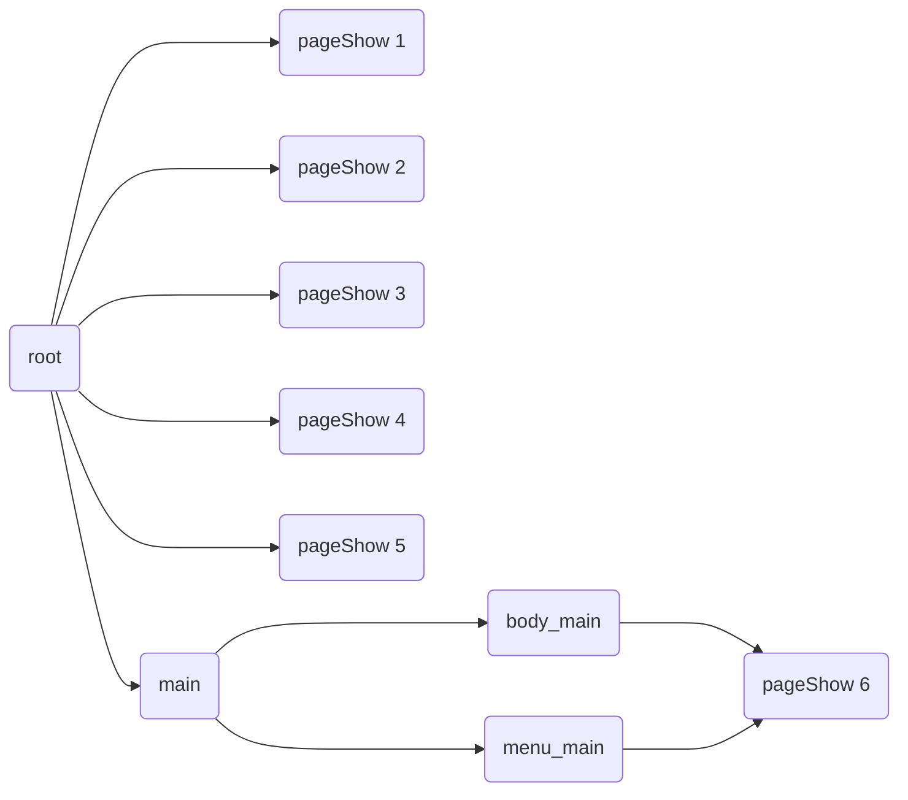
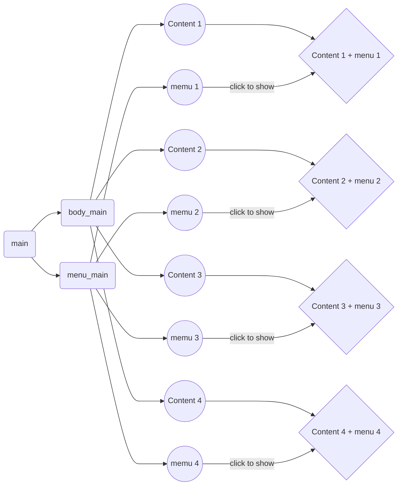
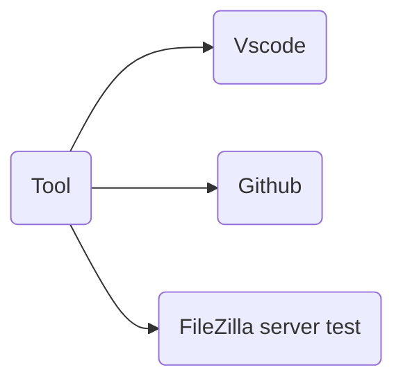

# Login Model
## Structure Project
All components have 4 parts

- [CSS Structure](#CSS-Structure)
    - [Login css](#login-css)
    - [Main css](#main-css)
- [Html Structure](#html-Structure)
    - [Index html structure](#index-html-structure)      
    - [Page init html](#page-init-html)
    - [Login html structure](#login-html-structure)
    - [Main html structure](#main-html-structure)
       
- [Javascript Structure](#javascript-structure)
    - [Index javascript structure](#index-javascript-structure)
      - [Chart components index page](#chart-components-index-page)
    - [Main javascript structure](#main-javascript-structure)
      - [Chart components main page](#chart-components-main-page)

- [Tool](#tool)


### CSS Structure

#### Login css

```javascript

// Initail html project
html {
    user-select: none;
    -webkit-touch-callout: none;
    -webkit-user-select: none;
    -khtml-user-select: none;
    -moz-user-select: none;
    -ms-user-select: none;
    font-family: 'Roboto', sans-serif
}

/* main */

input:focus,
select:focus {
    outline: none;
}

.swal2-modal .swal2-styled:focus {
    -webkit-box-shadow: none;
    box-shadow: none;
}

.swal2-container>.swal2-popup {
    width: 80%;
}

.menuCss {
    height: 100%;
    display: flex;
    justify-content: center;
    align-items: center;
}

/* login */ 

// for custom bg page Init
.pageInit {
    background: linear-gradient(25deg, #E0EAFC 0%, #8da9f5 100%);
    position: absolute;
    flex-direction: column;
}
// box in put class login
.coverBoxInput {
    display: flex;
    justify-content: center;
    width: 80%;
    position: relative;
    margin: 0 auto;
}

.coverBoxInput>img {
    position: absolute;
    left: 20px;
    width: 25px;
    height: 25px;
}

.boxInput {
    padding: 5px 20px;
    border: 0px;
    background-color: #fff;
    width: 80%;
    height: 45px;
    border-radius: 5px;
    font-size: var(--text-size02);
    border-radius: 20px;
    box-shadow: 1px 4px 4px 0px #457BFF3D inset;
    padding-left: 58px;
    width: 100%;

}

// Submit botton login
.btnComm {
    display: flex;
    justify-content: center;
    align-items: center;
    color: #ffffff;
    background-color: var(--bg-theme);
    border-radius: 10px;
    font-weight: bold;
    width: 80%;
    height: 45px;
    border-radius: 20px;
}

.spanUnderSubmit {
    width: 90%;
    height: 40px;
    font-size: 14px;
    gap: 10px;
    font-weight: bold;
}
// Check box 
.checkbox {
    width: 16px;
    height: 16px;
    border-radius: 8px;
    border: 1px #999999 solid;
}


```
#### Main css 

```javascript

// position start 
.positionZero {
    position: 0px;
    top: 0px;
    left: 0px;
}

// Img size
.bgSizeCover {
    background-repeat: no-repeat;
    background-size: cover;
}

// box menu
.coverMenu {
    width: 100%;
    height: 100%;
    display: flex;
    justify-content: center;
    align-items: center;
    border-top: 1px solid #b5b5b5;
}

// each menu
.menuDiv {
    width: 25%;
    flex-direction: column;
    gap: 0;
}

// span menu
.menuSpan {
    font-size: 10px; color: #97979B;
}


```


### Html Structure

#### Index html structure

Overall structure html project ( All components will show in index.html)

```javascript
<!DOCTYPE html>

<head>
    <meta charset="utf-8">
    <meta name="viewport"
        content="width=device-width, initial-scale=1.0, user-scalable=no, minimum-scale=1.0, maximum-scale=1.0" />
    <meta http-equiv="Cache-Control" content="no-cache, no-store, must-revalidate" />
    <meta http-equiv="Pragma" content="no-cache" />
    <meta http-equiv="Expires" content="0" />
    // Link CSS
    <link rel="shortcut icon" href="#" />
    <link rel="stylesheet" href="js/spinnew.css?version=1.1.38" />
    <link rel="stylesheet" href="css/login.css">
    <link rel="stylesheet" href="css/main.css">
    <link href='https://fonts.googleapis.com/css?family=Roboto' rel='stylesheet'>
    <link rel="stylesheet" href="css/quill.core.css?version=1.3.6" />
    <link rel="stylesheet" href="css/quill.mention.min.css?version=3.1.0" />

    // Link Script js
    <script language="javascript" type="text/javascript" src="js/jquery.js?version=1.0.0.1"></script>
    <script language="javascript" type="text/javascript" src="js/jquery.transit.js?version=1.0.0.1"></script>
    <script language="javascript" type="text/javascript" src="js/base64.js"></script>
    <script language="javascript" type="text/javascript" src="js/widget.js"></script>
    <script language="javascript" type="text/javascript" src="js/wsFormat.js"></script>
    <script language="javascript" type="text/javascript" src="js/iscroll-probe.js"></script>
    <script language="javascript" type="text/javascript" src="js/pic.js?version=1.0.1"></script>
    <script language="javascript" type="text/javascript" src="js/clipboard.min.js"></script>
    <script language="javascript" type="text/javascript" src="js/spinnew.js?version=1.0.0.1"></script>
    <script language="javascript" type="text/javascript" src="js/quill.min.js?version=1.3.6"></script>
    <script language="javascript" type="text/javascript" src="js/quill.mention.min.js?version=3.1.0"></script>
    <script language="javascript" type="text/javascript" src="js/language.js"></script>
    <script language="javascript" type="text/javascript" src="js/sweetalert2.all.min.js"></script>
    <script language="javascript" type="text/javascript" src="js/fontawesome.min.js"></script>
    <script language="javascript" type="text/javascript" src="js/solid.js"></script>

</head>

<style>
  
  // all display css

    .flexCenter {
        display: flex;
        justify-content: center;
        align-items: center;
    }
    .flexLeft {
        display: flex;
        justify-content: left;
        align-items: center;
    }
    .flexRight {
        display: flex;
        justify-content: right;
        align-items: center;
    }
    .flexTop {
        display: flex;
        justify-content: start;
        align-items: center;
    }
    .flexBottom {
        display: flex;
        justify-content: end;
        align-items: center;
    }
    .flexSpac {
        display: flex;
        justify-content: space-between;
        align-items: center;
    }

  

</style>

<body style="overflow: hidden; margin: 0px;">

    // Content show
    <div id="root" class="font-medium" ></div>


    // Alert boxs message
    <div id="messageBox"
        style="z-index: 997;position: absolute;left: 0px;top: 0px;display: none;width: 1px;height: 1px;">
        <div id="messageBoxBg" style="position: absolute;left: 0px;top: 0px;background-color: #000000;opacity: 0.7;">
        </div>
        <div id="messageBoxBodyBg"
            style="position: absolute;left: 0px;top: 0px;display: flex;justify-content: center;align-items: center;">
            <div id="messageBoxBody"
                style="background-color: #f7f7f7;border-radius: 15px;box-shadow: 0px 0px 5px 5px rgb(0, 0, 0,0.2);">
                <div style="height: 20px;"></div>
                <div id="msgContent"
                    style="text-align: center;width: 80%;height: 140px;display: flex;justify-content: center;align-items: center;margin: auto;">
                    Content
                </div>
                <div
                    style="width: 100%;height:30px;display: flex;justify-content: center;align-items: center;margin-top: 3px;">
                    <div id="msgBtnOK"
                        style="width:100%;height:45px;background-color:#ff5b5a;border-radius:0px 0px 0px 5px;display: flex;justify-content: center;align-items: center;color: #ffffff;">
                        确认</div>

                    <div style="background-color:#868686;width:2px"></div>
                    <div id="msgBtnCancel"
                        style="width:100%;height:45px;background-color:#ededed;border-radius: 0px 0px 5px 0px;display: flex;justify-content: center;align-items: center;">
                        取消</div>
                </div>
                <div style="height: 10px;"></div>
            </div>
        </div>
    </div>

    // Alert boxs message
    <div id="messagePage"
        style="z-index: 996;position: absolute;left: 0px;top: 0px;display: none;width: 1px;height: 1px;">
        <div id="messagePageBg" style="position: absolute;left: 0px;top: 0px;background-color: #000000;opacity: 0.7;">
        </div>
        <div id="messagePageBodyBg"
            style="position: absolute;left: 0px;top: 0px;display: flex;justify-content: center;align-items: center;">
            <div id="messagePageBody"
                style="background-color: #f7f7f7;border-radius: 15px;box-shadow: 0px 0px 5px 5px rgb(0, 0, 0,0.2);">
                <div style="height: 30px;display: flex;">
                    <div id="msgPageBtnClose"
                        style="display: none;justify-content: center;align-items: center;width: 30px;height: 100%;">
                        x
                    </div>
                </div>
                <div id="msgPageContent"
                    style="width: 100%;height:160px;display: flex;justify-content: center;align-items: center;">
                    Content
                </div>
                <div style="height: 10px;"></div>
            </div>
        </div>
    </div>

    // Alert boxs message
    <div id="alert"
        style="display: none;z-index: 998;position: absolute;left: 0px;top: 0px;background-color: #000000;opacity: 0.9;justify-content: center;align-items: center;">
        <div id="alertMsg"
            style="display: flex;justify-content: center;align-items: center;background-color: #cccccc;border-radius: 20px;padding: 10px;">

        </div>
    </div>
    // Loading page
    <div id="loader"
        style="display: none;z-index: 999;position: absolute;left: 0px;top: 0px;background-color: #000000;opacity: 0.4;justify-content: center;align-items: center;">

    </div>

</body>

</html>


```


#### Page init html

Conponents comon for using all new page show

```javascript

<div id="startPage" class="flexCenter pageInit">

// header detail
    <div id="start_header"></div>
// body detail
    <div id="start_body"></div> 
   
</div>

<script>

    var startObj = new start();
    startObj.init();
    function start() {
        this.init = function() {
            pageInit("startPage");
            headerInit("start", "Start")
        }
        this.call = funtion() {
            pageShow("startPage")
        }
        function loadlist() {

        }
    }
</script>

```


#### Login html structure

```javascript

<div id="loginPage" class="flexCenter pageInit">

    <div style="height: 20px;"></div>

    <div style="width: 100%;" class="flexCenter loginImg">
        
    </div>

    <div style="height: 10px;"></div>

    <div class="flexCenterColW100">

        <div id="welcome_back" class="headerSpan">Welcome Back</div>
        <div style="height: 15px;"></div>
        <div id="sign_to_con">Sign to continue</div>
        <div style="height: 15px;"></div>

    </div>

    <div class="flexCenterColW100">

        <div style="height: 20px;"></div>

        // input box
        <div class="coverBoxInput">
            
            <input id="mobileLogin" class="boxInput" type="number" placeholder="Phone" pattern="/^-?\d+\.?\d*$/"
                onKeyPress="if(this.value.length==11) return false;" />
        </div>
        <div style="height: 15px;"></div>

        <div class="coverBoxInput">
            
            <input id="password" class="boxInput" type="password" placeholder="Password"/>
        </div>

        <div style="height: 15px;"></div>

        <div class="flexCenter" style="font-size: 10px;">
            <input type="checkbox" id="checkBtnAgreementBtnLogin" class="checkbox">
            <div style="width:5px"></div>
            <span id="login_span1" style="color: #000;"></span>&nbsp;
            <span id="login_span2" style="color:#457BFF;"></span>&nbsp;
            <span id="login_span3" style="color: #000;"></span>&nbsp;
            <span id="login_span4" style="color:#457BFF ;"></span>
        </div>

        <div style="height: 20px;"></div>

    </div>

    // submit box
    <div class="login_bottom flexEndColW100">

        <div id="loginBtn" class="btnComm">Login</div>
        <div style="height: 10px;"></div>
        <div class="flexCenter spanUnderSubmit">
            <div id="noAccount"></div>
            <div style="color:#457BFF;" id="goRegisterBtn"></div>
        </div>

    </div>

    <div style="height: 10px;"></div>

</div>

```


#### Main html structure


```javascript

<div id="main" class="positionZero">

    // body contents
    <div id="body_main" class="bgSizeCover">
    </div>

    // menu contents
    <div id="menu_main" style="width: 100%;">
    
        <div id="menu_main_content" class="bg-foot-all coverMenu">
           
            // Icons home
            <div id="menu_home" class="menuCss menuDiv">
                <div class="menuCss_pic">
                    <div class="menuOnClass" id="menuHome">
                        <svg >Icon1</svg>
                    </div>
                    <div class="menuOffClass" id="menuHome2" style="display: none;">
                        <svg>Icons1</svg>
                    </div>
                </div>
                <span class="menuSpan" id="menuHomeSpan">Home</span>
            </div>

            // Icons trade
            <div id="menu_trade" class="menuCss menuDiv">
                <div class="menuCss_pic">
                    <div class="menuOnClass" id="menuTrade" style="padding-top: 2px;">
                        <svg>Icons2</svg>
                    </div>
                    <div class="menuOffClass" id="menuTrade2" style="display: none; padding-top: 2px;">
                        <svg>Icons2</svg>
                    </div>
                </div>
                <span class="menuSpan" id="menuTradeSpan">Trade</span>

            </div>

            // Icons wallet
            <div id="menu_wallet" class="menuCss menuDiv">
                <div class="menuCss_pic">
                    <div class="menuOnClass" id="menuwallet">
                        <svg>Icons3</svg>
                    </div>
                    <div class="menuOffClass" id="menuwallet2" style="display: none;">
                        <svg>Icons3</svg>
                    </div>
                </div>
                <span class="menuSpan" id="menuwalletSpan">Wallet</span>
            </div>

            // Icons setting
            <div id="menu_setting" class="menuCss menuDiv">
                <div class="menuCss_pic">
                    <div class="menuOnClass" id="menuSetting">
                        <svg>Icons4</svg>
                    </div>
                    <div class="menuOffClass" id="menuSetting2" style="display: none;">
                        <svg>Icons4</svg>
                    </div>
                </div>
                <span class="menuSpan" id="menuSettingSpan">Setting</span>
            </div>


        </div>
    </div>

</div>

```


### Javascript Structure

#### Index javascript structure

```javascript

<script>


    var API_SERVER = "http://18.142.136.157/api";
    var WS_SERVER = "ws://18.142.136.157/api";


    var token = null;
    var deviceId = null;
    var platform = null;
    var refreshTokenTimer = null;
    var heartBeatTimer = null;
    var heartBeatTimeStamp = 0;

    var TIMEOUT = 10000;
    var PAGETIMEOUT = 300;//页面切换时间

    //  width, height auto display
    var w = $(window).width();
    var h = $(window).height();

    var headH = 50;
    var menuH = 60;

    var alertObj = new alert();
    alertObj.init();
    var loaderObj = new loader();
    loaderObj.init();
    var msgObj = new messageBox();
    msgObj.init();
    var msgPageObj = new messagePage();
    msgPageObj.init();

    // set lang default
    var lang = localStorage.getItem('Language')
    if (lang == '' || lang == null) {
        localStorage.setItem('Language', 'EN')
    }
    var themeChange = localStorage.getItem('Theme')

    // set theme default
    if (themeChange == '' || themeChange == null || themeChange == 'theme-default') {
        localStorage.setItem('Theme', 'theme-default')
        $('#root').removeClass().addClass("theme-default");
    }
   
    // set size default
    var getFont = localStorage.getItem('Font-size')
    if (getFont == '' || getFont == null) {
        localStorage.setItem('Font-size', 'medium')
        $('body').removeClass().addClass("font-medium");
    }

    // convert html to res.json to build app
    var mResObj = new resObj("res.json");
    mResObj.setSuccessFun(startApp);
    mResObj.setErrorFun(errorApp);

    mResObj.init();
    mResObj.load();

    function startApp() {

        mResObj.showHtml("main.html", "root");
        mResObj.showHtml("start.html", "root");
        mResObj.showHtml("login.html", "root");
        mResObj.showHtml("register.html", "root");  
            
        mainObj.checkIsLogin();

        ChangeLanguage();
        firstStartFun();

    }
    function errorApp() {
        console.log("load error");
    }

    function onBackPressed() {
        console.log('========>');
    }

    function setKeyboardHeight(mH) {
        chatRoomObj.setKeyboardHeight(mH);
    }

    function setDeviceId(mDeviceId, mPlatform) {
        deviceId = mDeviceId;
        platform = mPlatform;
    }

    function appComeback() {
        var t = new Date();
        console.log("i'm back !" + t.getTime());
        //loginObj.checkLoginStatusWithRefreshToken();
    }

    function openAgreement() {
        pageShow('agreementPage');
    }

    function openPrivacy() {
        pageShow('privacyPage');
    }

    function firstStartFun() {

        if (!checkIsAndroid()) {
            return;
        }
        var isNotFirst = localStorage.getItem('isFirst');
        if (!isNotFirst) {
            pageShow('firstStartPage');
        }

    }

    // Token check funtion
    function firstCheckToken() {

        if (token == null) {
            pageShow("loginPage");
            return;
        }

        var mData = { "token": token.refresh };

        $.ajax({
            type: "post",
            url: API_SERVER + "/v1/auth/refresh",
            data: JSON.stringify(mData),
            contentType: "application/json",
            dataType: "json",
            async: true,
            timeout: 100000,
            beforeSend: function (xmlhttprequest) {
            },
            success: function (data) {
                if (data.code == 0) {
                    var tokenObj = data.result;
                    localStorage.setItem('token', JSON.stringify(tokenObj));
                    getLocalToken();
                } else {
                    if (data.code == 4002) {
                        pageShow("loginPage");
                    }
                }
                // call home page show
                mainObj.menuhome();
            },
            error: function (xmlhttprequest, error) {
                console.log(error);
            },
            complete: function () {
            }
        });


    }

</script>

```

##### Chart components index page


All components will be show in root in index.html


#### Main javascript structure


```javascript

<script>
    console.log("main");

    var mainObj = new main();
    mainObj.init();


    function main() {

        // init main 
        this.init = function () {

            $("#menu_main").css({ "height": menuH });
            $("#body_main").css({ "height": h - menuH });


            $("#menu_home").click(function () {
                mainObj.menuhome();
                
            });

            $("#menu_trade").click(function () {
                mainObj.menutrade();
                
            });

            $("#menu_wallet").click(function () {
                mainObj.menuwallet();
                
            });

            $("#menu_setting").click(function () {
                mainObj.menusetting();
                
            });

            // show contents
            mResObj.showHtml("home.html", "body_main");
            mResObj.showHtml("trade.html", "body_main");
            mResObj.showHtml("wallet.html", "body_main");
            mResObj.showHtml("setting.html", "body_main");

        }

        // Show home page
         this.menuhome = function () {
            unShowMenuPage();

            $(".menuOnClass").css({ "display": "none" });
            $(".menuOffClass").css({ "display": "block" });
            $("#menuHome").css({ "display": "block" });
            $("#menuHome2").css({ "display": "none" });
            $("#menuHomeSpan").css({ "color": "var(--bg-foot)", "font-size": "12px" });
            $("#menuTradeSpan").css({ "color": "#97979B", "font-size": "10px" });
            $("#menuwalletSpan").css({ "color": "#97979B", "font-size": "10px" });
            $("#menuSettingSpan").css({ "color": "#97979B", "font-size": "10px" });
            // $("#body_main").css({ "background-image": "url(pic/new_bg.png)" });
            $("#main").css({ "background-color": "#80DEEA" });
            homeObj.init()
            homeObj.call()
            ChangeLanguage()
        }

        // Show trade page
        this.menutrade = function () {
            unShowMenuPage();

            $(".menuOnClass").css({ "display": "none" });
            $(".menuOffClass").css({ "display": "block" });
            $("#menuTrade").css({ "display": "block" });
            $("#menuTrade2").css({ "display": "none" });
            $("#menuHomeSpan").css({ "color": "#97979B", "font-size": "10px" });
            $("#menuTradeSpan").css({ "color": "var(--bg-foot)", "font-size": "12px" });
            $("#menuwalletSpan").css({ "color": "#97979B", "font-size": "10px" });
            $("#menuSettingSpan").css({ "color": "#97979B", "font-size": "10px" });
            $("#main").css({ "background-color": "#F8BBD0" });
            
            ChangeLanguage()
            tradeObj.init()
            tradeObj.call();
        }

        // Show wallet page
        this.menuwallet = function () {
            unShowMenuPage();

            $(".menuOnClass").css({ "display": "none" });
            $(".menuOffClass").css({ "display": "block" });
            $("#menuwallet").css({ "display": "block" });
            $("#menuwallet2").css({ "display": "none" });
            $("#menuHomeSpan").css({ "color": "#97979B", "font-size": "10px" });
            $("#menuTradeSpan").css({ "color": "#97979B", "font-size": "10px" });
            $("#menuwalletSpan").css({ "color": "var(--bg-foot)", "font-size": "12px" });
            $("#menuSettingSpan").css({ "color": "#97979B", "font-size": "10px" });
            $("#main").css({ "background-color": "#DCEDC8" });

            walletObj.init();
            walletObj.call();
            ChangeLanguage()

        }

        // Show setting page
        this.menusetting = function () {
            unShowMenuPage();

            $(".menuOnClass").css({ "display": "none" });
            $(".menuOffClass").css({ "display": "block" });
            $("#menuSetting").css({ "display": "block" });
            $("#menuSetting2").css({ "display": "none" });
            $("#menuHomeSpan").css({ "color": "#97979B", "font-size": "10px" });
            $("#menuTradeSpan").css({ "color": "#97979B", "font-size": "10px" });
            $("#menuwalletSpan").css({ "color": "#97979B", "font-size": "10px" });
            $("#menuSettingSpan").css({ "color": "var(--bg-foot)", "font-size": "12px" });
            $("#main").css({ "background-color": "#CFD8DC" });
            
            ChangeLanguage()
            settingObj.init()
            settingObj.call();


        }
        
        // Check login
        this.checkIsLogin = function () {
            getLocalToken();
            updateLoginStatus();
            if (token != null) {
                mainObj.refreshToken();
            } else {
                pageShow('startPage');
            }
        }

        // hide page
        function unShowMenuPage() {
            $(".menuPage").each(function () {
                $("#" + this.id).transition({
                    x: 0
                }, 0);
            });
            $(".menuHeader").each(function () {
                $("#" + this.id).transition({
                    x: 0
                }, 0);
            });
        }

        // update login status
        function updateLoginStatus() {
            var isLogin = false;
            if (token != null) {
                var nowTimeStamp = (new Date()).getTime();
                if (token.expire) {
                    var expireTime = token.expire * 1000;
                    if (nowTimeStamp < expireTime) {
                        isLogin = true;
                    } else {
                        mainObj.refreshToken();
                    }
                }
            }

            if (isLogin) {
                pageUnShow("loginPage");
                pageUnShow("startPage");
                mainObj.menuhome();
            } else {
                pageShow("startPage");
            }
        }

        // get token in storage
        function getLocalToken() {
            var tokenLocal = localStorage.getItem('token');
            if (tokenLocal != null) {
                token = JSON.parse(tokenLocal);
            }
        }

        var isRefreshTokenFinish = true;

        // refresh token
        this.refreshToken = function () {

            if (refreshTokenTimer) {
                clearInterval(refreshTokenTimer);
            }
            refreshTokenTimer = setInterval(function () {
                refreshTokenFun();
            }, 1800000);
        }

        function refreshTokenFun() {

            if (token == null) {
                pageShow("startPage");
                return;
            }

            var mData = { "token": token.refresh };

            isRefreshTokenFinish = false;

            $.ajax({
                type: "post",
                url: API_SERVER + "/v1/auth/refresh",
                data: JSON.stringify(mData),
                contentType: "application/json",
                dataType: "json",
                async: true,
                timeout: 100000,
                beforeSend: function (xmlhttprequest) {
                },
                success: function (data) {

                    if (data.code == 0) {
                        var tokenObj = data.result;
                        localStorage.setItem('token', JSON.stringify(tokenObj));
                        getLocalToken();
                        isRefreshTokenFinish = true;

                    } else {
                        mainObj.checkAjaxResult(data.code);
                    }
                },
                error: function (xmlhttprequest, error) {
                    console.log(error);
                },
                complete: function () {
                }
            });


        }

        this.checkAjaxResult = function (code, fun4001) {
            switch (code) {
                case 4001:
                    refreshTokenFun();
                    if (fun4001) {
                        fun4001();
                    } else {
                        logoutFun();
                    }
                    break;
                case 4002:
                    logoutFun();
                    break;
                case 4020:
                    if (isRefreshTokenFinish) {
                        Swal.fire({
                            icon: 'warning',
                            showConfirmButton: false,
                            title: `<span style='color:#1E232C;font-size: var(--text-size03);'><b id='main_device'></b></span>`,
                            html: '<div style="display: flex;justify-content: space-between;align-items: center;">' +
                                '</div>'
                        })
                        ChangeLanguage();

                        logoutFun();
                    } else {
                        refreshTokenFun();
                    }
                    break;
            }

            function logoutFun() {
                localStorage.removeItem("token");
                token = null;
                mainObj.checkIsLogin();
                if (heartBeatTimer) {
                    clearInterval(heartBeatTimer);
                }
                if (refreshTokenTimer) {
                    clearInterval(refreshTokenTimer);
                }
            }
        }


    }


</script>


```


##### Chart components main page


on click menu to show content


### Tool

Tooling for using in coding project


